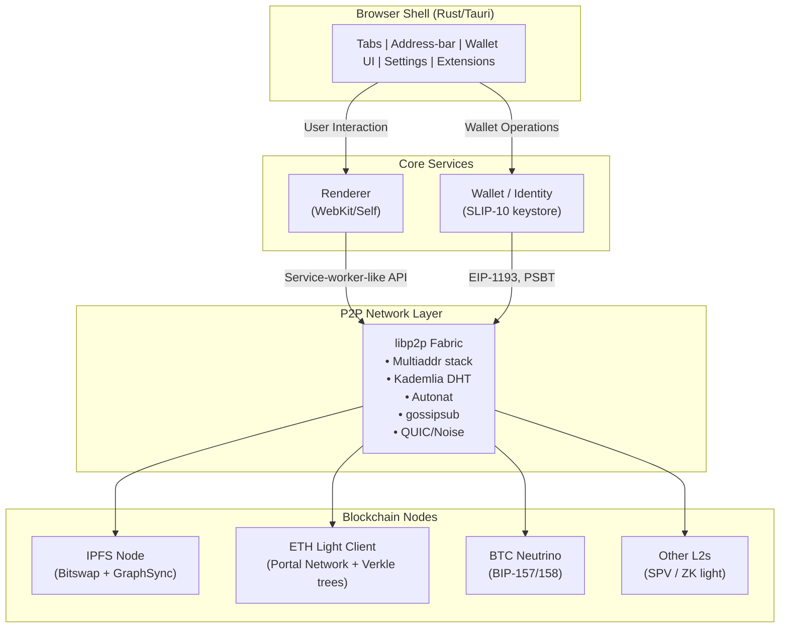
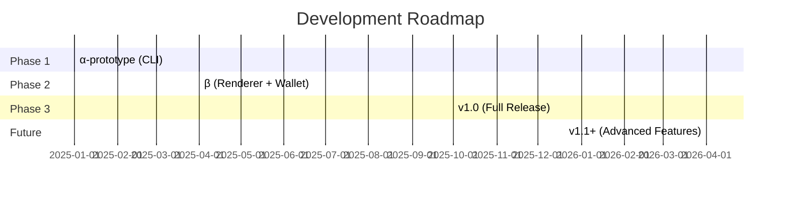
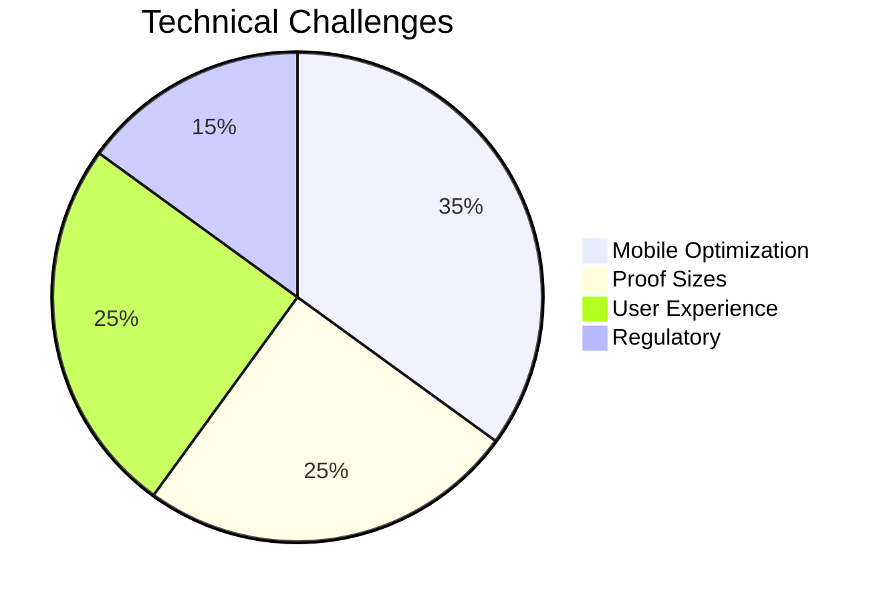
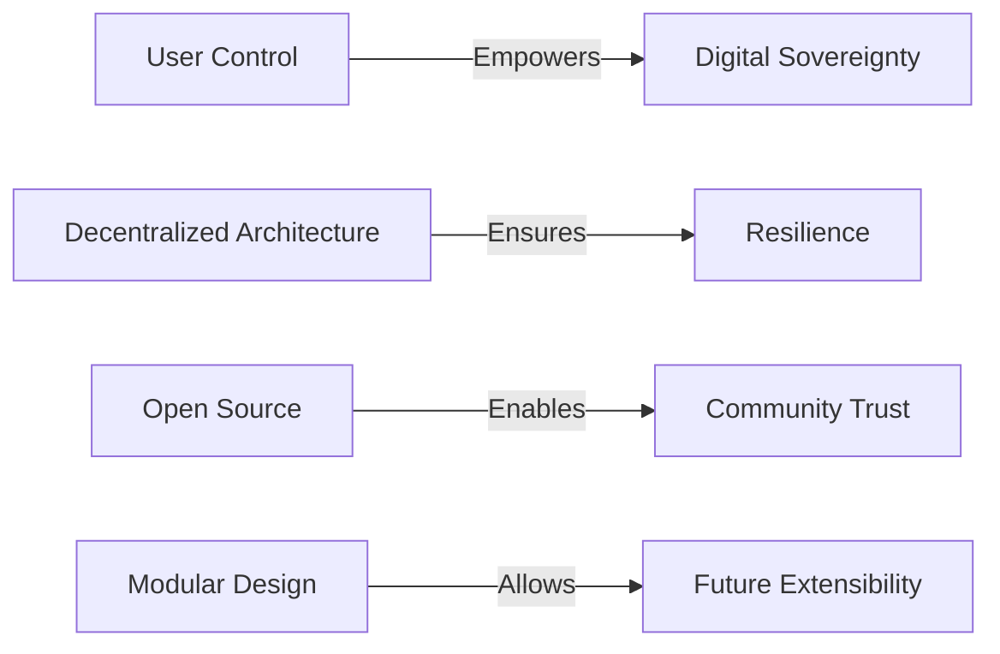

# 🌐 Decentralized Web Browser

A blueprint for building a fully-decentralized browser that can fetch content from IPFS, interact directly with blockchains, and provide a smooth user experience comparable to Chrome or Safari.

---

## 🎯 1. Clarify the End-State

| Requirement | What it means in practice |
|-------------|---------------------------|
| **No single point of failure** | The browser must resolve names, download assets, and submit transactions without relying on any vendor-hosted gateway, RPC service, or DNS server. |
| **End-to-end verifiability** | Every byte that reaches the renderer must be content-addressed (IPFS CID or a blockchain Merkle proof) so the user can verify authenticity offline. |
| **Local keys = local authority** | Wallet keys never leave the machine; signing flows happen in a hardware wallet or an isolated OS key-slot. |
| **Opt-in bridges only** | HTTP(S) and DNS gateways are plug-ins that a power-user can turn on, but they start disabled. |

> **Note**: Projects like Brave show it is possible to bundle an IPFS node, but they still default to central RPC endpoints and HTTP fall-backs, making them only "partly decentralised.”  

⸻

## 🏗️ 2. High-Level Architecture

> **Note**: Everything in the P2P Network Layer and below operates in a peer-to-peer manner; there is no centralized "backend."”

⸻

## 🔧 3. Key Subsystems & Design Choices

| Subsystem | Design Notes |
|-----------|--------------|
| **Networking** | Use libp2p for discovery, multiplexing and encryption—IPFS, Portal (Ethereum), Filecoin, and Polkadot all share it, so one stack serves many chains. This keeps binary size reasonable. |
| **Content Retrieval** | Implement the `ipfs://` and `ipns://` schemes natively. A request returns a CID, the browser asks Bitswap/GraphSync for the corresponding blocks, verifies each block's hash, reconstructs the file, and streams it into the renderer pipe. |
| **Blockchain RPC** | Ship embedded light clients: • Ethereum: Portal client + optional ZK-verifier for historical proofs • Bitcoin: Neutrino • EVM side-chains: sync headers only, then use on-demand proofs  No Infura/Alchemy by default (users may add them as a "bridge" plug-in). |
| **Name Resolution** | Two layers: 1. ENS/Handshake/Unstoppable via on-chain look-ups 2. IPNS records (mutable signed pointers inside libp2p DHT)  ENS → IPFS hash mapping gives human-readable URLs without DNS. |
| **Wallet & Signing** | Follow Frame's approach of exposing a system-wide provider (`window.ethereum`, `window.btc`) so any dApp or even an external CLI can request a signature through DBus/Native-messaging. Hardware wallets get first-class support (Ledger, Trezor, GridPlus) just like Frame does. |
| **Execution Sandbox** | Keep Chromium/Servo rendering but run third-party JS in isolated WebAssembly compartments with a capability (cap)-oriented API. A cap can grant IPFS read, blockchain call, or sign rights independently. |
| **Updates** | Ship the core via IPFS as a signed immutable bundle. The browser only trusts a new version if: 1. The CID matches a hash pinned in the project's community multisig on the governance chain, and 2. The binary signature matches at least N-of-M developer keys. |
| **Privacy Defaults** | 1 Hop DHT queries, dandelion++ transaction relay, optional Tor/Noise transports, and no telemetry—metrics are published by opt-in relays and aggregated off-chain. |
| **Bridges (Optional)** | A "gateway" plug-in can forward unresolved requests to HTTPS or a central RPC, but the UI shows a clear yellow indicator so the user knows they have left the trustless zone. |

⸻

## 🔄 4. Boot-sequence (cold start → first page)

1. **Bootstrap peers** – Hard-code 20 multiaddrs (can be replaced by scanning a QR code or Bluetooth-pairing with a friend).
2. **Sync chain headers** – Download compact headers for each blockchain the user enables.
3. **Initialize IPFS** – Join the IPFS swarm and prime a small block cache (logo, fonts, UI assets).
4. **Load home tab** – Open the home tab served from a pinned CID; no HTTP involved.

⸻

## 🛠️ 5. Developer Ergonomics

| Feature | Why it matters |
|---------|----------------|
| **File-system overlay** (`ipfs mount`) | Developers can press Save in their editor and files immediately appear at a new CID with automatic tab hot-reloading. |
| **Chain-emulated test-nets** | Ship with Anvil-like in-process chains (EVM & Bitcoin regtest) for seamless development without external dependencies. |
| **Extension model** | Web-extensions use local IPC instead of `chrome.*` API, with UIs published as IPFS CIDs for true decentralization. |
| **CLI companion** | Powerful command-line interface with commands like `browserctl pin Qm…` and `browserctl send 0.1 ETH` for CI/CD integration. |

⸻

## 🔒 6. Security Hardening

- **Deterministic builds** using Nix/Guix for verifiable release hashes
- **Secure IPC** with protobuf-encoded and session key-signed inter-process messages
- **Strict CSP** defaulting to `ipfs://` and local origin only
- **Storage management** with automatic pin-set garbage collection and cost estimation for Filecoin/Arweave storage

⸻

## 🔍 7. Browser Comparison: Current State vs. Our Vision

| Browser | Current Capabilities | Centralization Concerns |
|---------|----------------------|-------------------------|
| **Brave** | • Bundles go-IPFS • Built-in EVM wallet | • Default RPC uses Brave/Infura • Falls back to HTTPS for slow IPFS blocks |
| **Frame** | • System-wide wallet • Hardware wallet support • Open source | • Requires user-supplied RPC endpoints |
| **Agregore/Beaker** | • Experimental P2P fetch • dat:// protocol support | • No production-grade light clients • No hardware wallet integration |

> **Our Solution** removes these bottlenecks by shipping all necessary components (light clients, DHT, P2P transport) in a single binary with community-governed updates via on-chain multisig.

⸻

## 🧱 8. Implementation Stack

| Layer | Technology | Why We Chose It |
|-------|------------|------------------|
| **P2P Transport** | rust-libp2p, quinn (QUIC) | Unified crate supporting multiple protocols |
| **IPFS** | rust-ipfs / firestorm | Memory-safe, async, libp2p-compatible |
| **Ethereum Light Client** | trin (Portal Network) + reth components | Modular Rust implementation |
| **Bitcoin Light Client** | neutrino-rs | Implements BIP-157/158 for compact verification |
| **WASM Sandbox** | wasmtime with capability masks | High-performance, security-audited runtime |
| **UI Framework** | tauri + wry | Native WebKit/WebView2/WebKitGTK with <60MB footprint |

⸻

## 🗓️ 9. Roll-out Plan

| Version | Timeline | Key Features |
|---------|----------|--------------|
| **α-prototype** | Q1 2025 | • CLI for `ipfs://` URLs • ENS → IPFS resolution |
| **β Release** | Q2 2025 | • Web renderer • Wallet UI • Ethereum Portal light client |
| **v1.0** | Q4 2025 | • Hardware wallet support • Bitcoin Neutrino • Auto-updates via CID-gated multisig |
| **v1.1+** | 2026+ | • Privacy transports • ZK-verified historical states • Community extension store |

⸻

## 🚧 10. Key Challenges

| Challenge | Impact | Mitigation Strategy |
|-----------|--------|----------------------|
| **Mobile Power Consumption** | High battery drain from light clients | • Optimize sync algorithms • Implement background throttling • Cache aggressively |
| **Large Proof Sizes** | ~40kB per Verkle proof impacts performance | • Implement proof batching • Explore ZK-succinct proofs • Progressive verification |
| **First-run Experience** | Long sync times may frustrate users | • Clear progress indicators • Progressive loading • PWA fallback mode |
| **Regulatory Compliance** | Potential KYC requirements in some regions | • Modular architecture • Optional compliance layers • Community governance for regional adaptations |

⸻

## 🎯 Take-away

> **A truly decentralised browser is not just "Chrome with an RPC key"**
> 
> It's a **self-sovereign node suite**—combining IPFS, light clients, and wallet functionality—
> wrapped in a familiar user experience. This blueprint delivers a powerful, all-in-one solution 
> that puts users in full control of their digital sovereignty.

### Key Benefits

- **User Empowerment**: Full control over data and digital identity
- **True Decentralization**: No reliance on centralized services
- **Verifiable Security**: All components are open source and auditable
- **Future-Proof**: Modular architecture adapts to evolving web standards

By following this blueprint, we can deliver a powerful, user-friendly browser that respects privacy and puts users back in control of their online experience.
