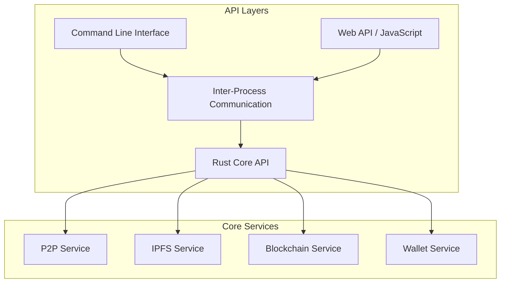

# API Documentation

## Overview

The Decentralized Browser provides multiple API layers for different use cases:



## Rust Core API

### P2P Service

```rust
use libp2p::{PeerId, Multiaddr};

pub struct P2PService {
    // Implementation details
}

impl P2PService {
    pub fn new(config: P2PConfig) -> Result<Self>;
    pub async fn start(&mut self) -> Result<()>;
    pub async fn dial_peer(&mut self, peer_id: PeerId) -> Result<()>;
    pub async fn dht_put(&mut self, key: Vec<u8>, value: Vec<u8>) -> Result<()>;
    pub async fn dht_get(&mut self, key: Vec<u8>) -> Result<Vec<u8>>;
}
```

### IPFS Service

```rust
use cid::Cid;

pub struct IPFSService {
    // Implementation details
}

impl IPFSService {
    pub async fn new(config: IPFSConfig) -> Result<Self>;
    pub async fn get(&self, cid: Cid) -> Result<Vec<u8>>;
    pub async fn add(&self, data: Vec<u8>) -> Result<Cid>;
    pub async fn pin(&self, cid: Cid, recursive: bool) -> Result<()>;
    pub async fn resolve_ipns(&self, name: &str) -> Result<Cid>;
}
```

### Blockchain Service

```rust
pub struct BlockchainService {
    // Implementation details
}

impl BlockchainService {
    pub fn new(config: BlockchainConfig) -> Self;
    pub async fn submit_transaction(&self, chain_id: ChainId, tx: Transaction) -> Result<TransactionHash>;
    pub async fn get_balance(&self, chain_id: ChainId, account: AccountId) -> Result<Balance>;
}
```

### Wallet Service

```rust
pub struct WalletService {
    // Implementation details
}

impl WalletService {
    pub fn new(config: WalletConfig) -> Self;
    pub fn create_wallet(&mut self, name: String, key_type: KeyType) -> Result<String>;
    pub fn sign_transaction(&self, wallet_name: &str, tx: &mut Transaction) -> Result<()>;
    pub fn get_address(&self, wallet_name: &str) -> Result<String>;
}
```

## TypeScript Web API

### Browser API Interface

```typescript
interface BrowserAPI {
  p2p: P2PAPI;
  ipfs: IPFSAPI;
  blockchain: BlockchainAPI;
  wallet: WalletAPI;
}

interface P2PAPI {
  getPeers(): Promise<PeerInfo[]>;
  connectPeer(peerId: string): Promise<void>;
  sendData(peerId: string, data: Uint8Array): Promise<void>;
}

interface IPFSAPI {
  get(cid: string): Promise<Uint8Array>;
  add(data: Uint8Array): Promise<string>;
  pin(cid: string, recursive?: boolean): Promise<void>;
  resolveIPNS(name: string): Promise<string>;
}

interface BlockchainAPI {
  submitTransaction(chainId: string, tx: Transaction): Promise<string>;
  getBalance(chainId: string, address: string): Promise<string>;
  getTransactionStatus(chainId: string, txHash: string): Promise<TransactionStatus>;
}

interface WalletAPI {
  listWallets(): Promise<WalletInfo[]>;
  createWallet(name: string, keyType: KeyType): Promise<string>;
  signTransaction(walletName: string, tx: Transaction): Promise<Transaction>;
  getAddress(walletName: string): Promise<string>;
}
```

## CLI Commands

### P2P Commands
```bash
browser p2p start [--port <PORT>]
browser p2p connect <PEER_ID>
browser p2p peers
browser p2p dht-get <KEY>
browser p2p dht-put <KEY> <VALUE>
```

### IPFS Commands
```bash
browser ipfs get <CID> [--output <FILE>]
browser ipfs add <FILE> [--pin]
browser ipfs pin <CID>
browser ipfs resolve <IPNS_NAME>
```

### Wallet Commands
```bash
browser wallet create <NAME> [--key-type <TYPE>]
browser wallet list
browser wallet address <NAME>
browser wallet sign <NAME> <MESSAGE>
```

### Blockchain Commands
```bash
browser blockchain tx <CHAIN_ID> <FROM> <TO> <AMOUNT>
browser blockchain balance <CHAIN_ID> <ADDRESS>
browser blockchain tx-status <CHAIN_ID> <TX_HASH>
```

## Plugin API

```rust
#[async_trait]
pub trait Plugin: Send + Sync {
    fn metadata(&self) -> PluginMetadata;
    async fn initialize(&mut self, context: &PluginContext) -> Result<()>;
    async fn handle_request(&self, request: &ContentRequest) -> Result<Option<ContentResponse>>;
    async fn handle_event(&self, event: &BrowserEvent) -> Result<()>;
}
```

## Error Handling

```rust
#[derive(thiserror::Error, Debug)]
pub enum BrowserError {
    #[error("Network error: {0}")]
    Network(#[from] NetworkError),
    #[error("IPFS error: {0}")]
    IPFS(#[from] IPFSError),
    #[error("Blockchain error: {0}")]
    Blockchain(#[from] BlockchainError),
    #[error("Wallet error: {0}")]
    Wallet(#[from] WalletError),
}
```

## Usage Examples

### Rust Example
```rust
use browser_core::*;

#[tokio::main]
async fn main() -> Result<()> {
    let mut p2p = P2PService::new(P2PConfig::default())?;
    p2p.start().await?;
    
    let ipfs = IPFSService::new(IPFSConfig::default()).await?;
    let content = ipfs.get(cid).await?;
    
    Ok(())
}
```

### TypeScript Example
```typescript
// Access browser API
const content = await window.browser.ipfs.get('QmHash...');
const peers = await window.browser.p2p.getPeers();

// Create and sign transaction
const wallets = await window.browser.wallet.listWallets();
const tx = await window.browser.wallet.signTransaction('my-wallet', transaction);
```

### CLI Example
```bash
# Start P2P service and fetch content
browser p2p start --port 4001
browser ipfs get QmYwAPJzv5CZsnA625s3Xf2nemtYgPpHdWEz79ojWnPbdG

# Create wallet and send transaction
browser wallet create my-wallet --key-type sr25519
browser blockchain tx substrate 5GrwvaEF... 5FHneW46... 1.0
```

For detailed implementation examples and advanced usage, see the [Development Guide](DEVELOPMENT.md) and [Architecture Guide](ARCHITECTURE.md).
