# Architecture Guide

## Overview

The Decentralized Web Browser is built as a modular, peer-to-peer system that eliminates reliance on centralized infrastructure. This document provides a comprehensive overview of the system architecture, design decisions, and component interactions.

## Table of Contents

- [System Architecture](#system-architecture)
- [Core Components](#core-components)
- [Data Flow](#data-flow)
- [Network Architecture](#network-architecture)
- [Security Model](#security-model)
- [Storage Architecture](#storage-architecture)
- [Component Interactions](#component-interactions)

## System Architecture

### High-Level Overview

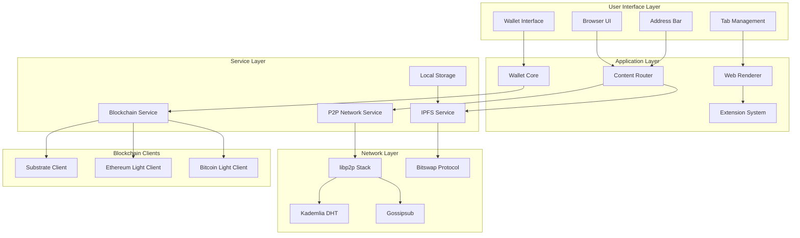

### Component Hierarchy

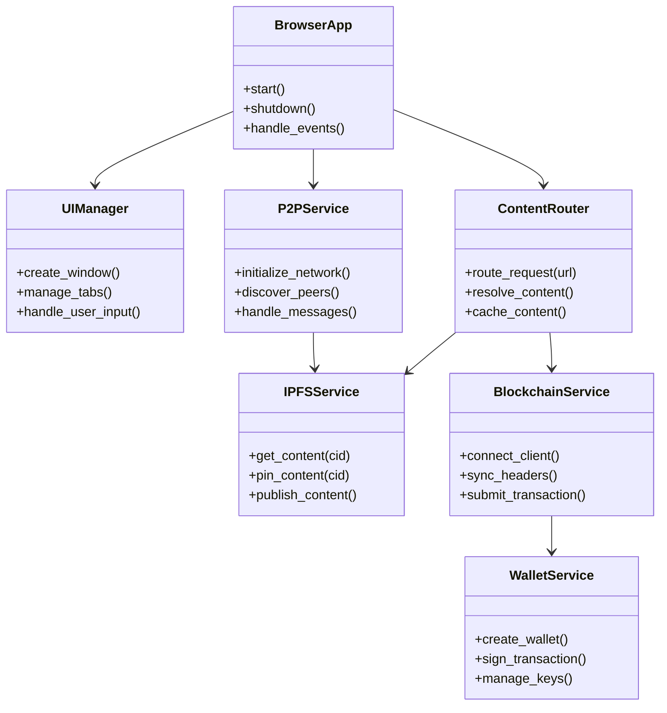

## Core Components

### 1. P2P Networking Layer

The P2P networking layer is built on libp2p and provides the foundation for all decentralized communication.

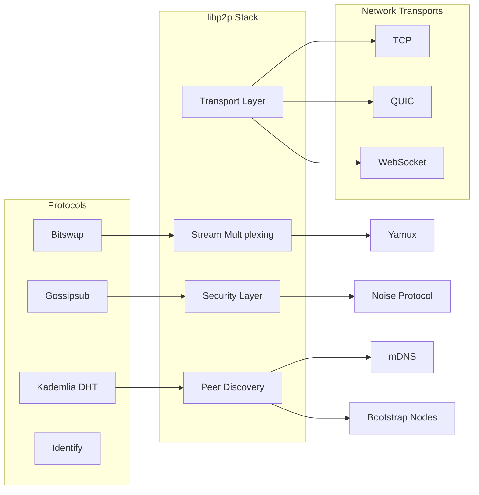

#### Key Features:
- **Multi-transport support**: TCP, QUIC, WebSocket
- **Security**: Noise protocol for encryption
- **Multiplexing**: Yamux for stream management
- **Discovery**: mDNS and bootstrap nodes

### 2. IPFS Integration

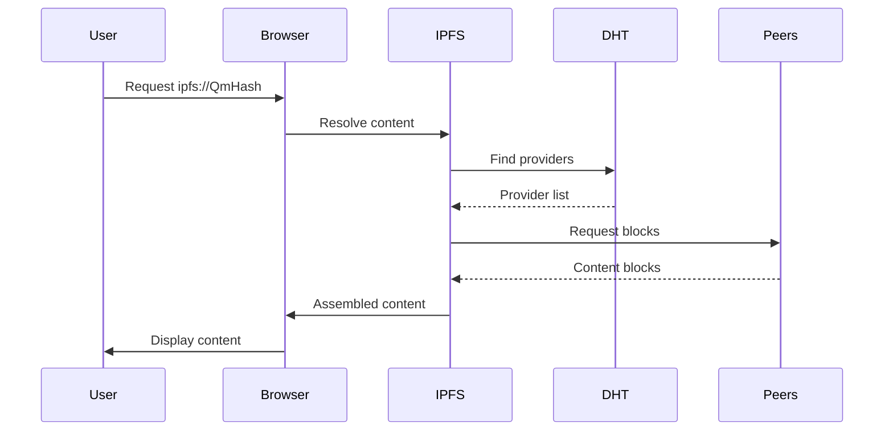

#### IPFS Service Architecture:

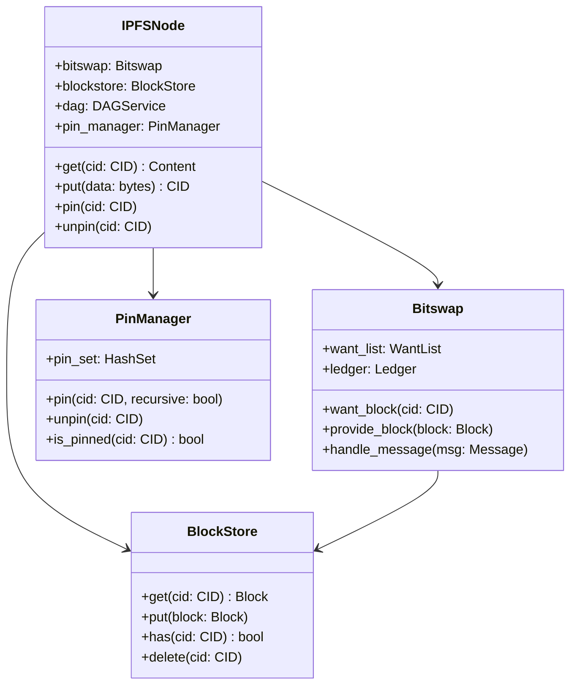

### 3. Blockchain Integration

The blockchain layer supports multiple chains through a unified interface:

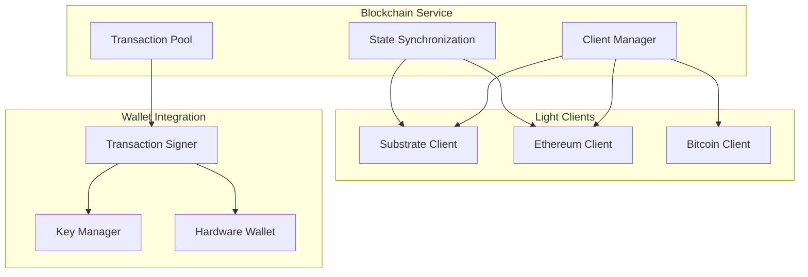

#### Substrate Client Architecture:

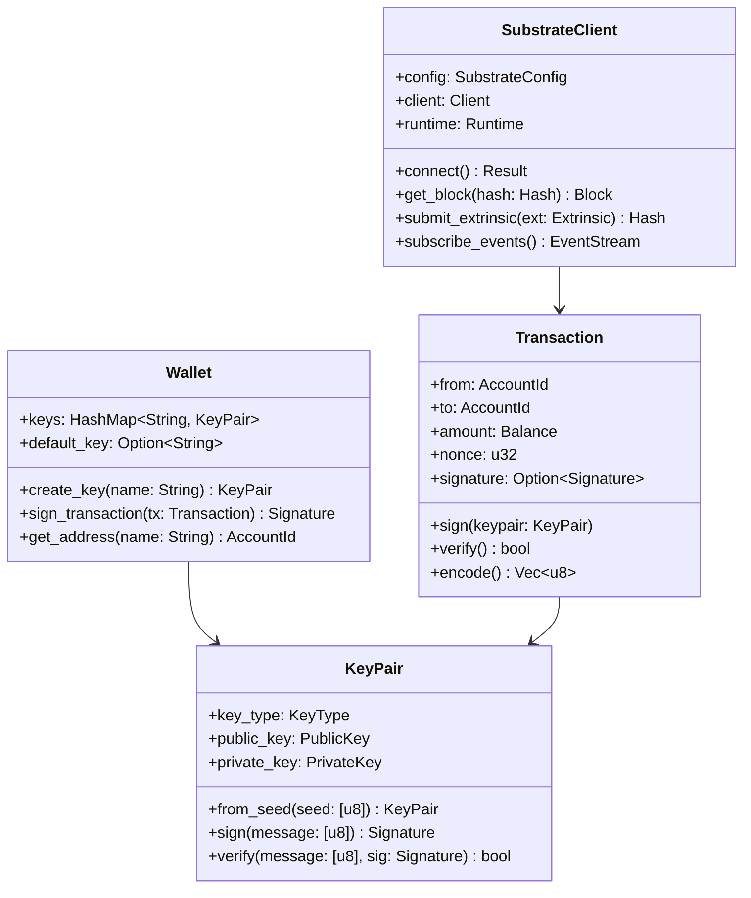

## Data Flow

### Content Resolution Flow

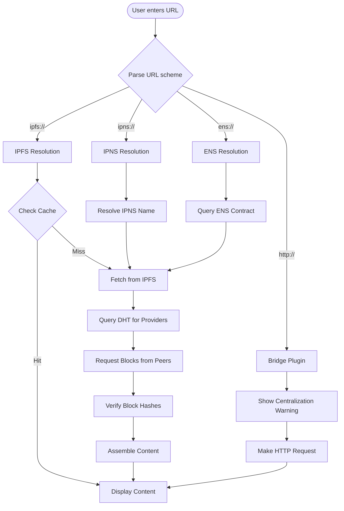

### Transaction Flow

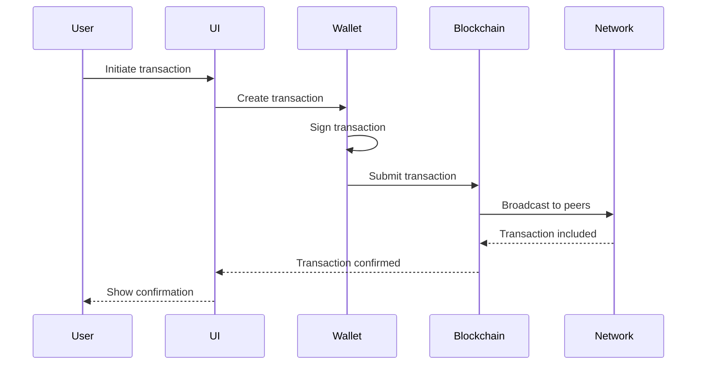

## Network Architecture

### Peer Discovery and Connection Management

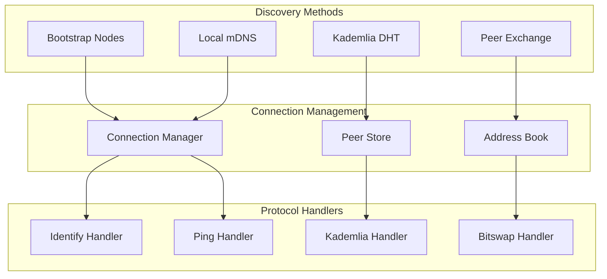

### Network Topology

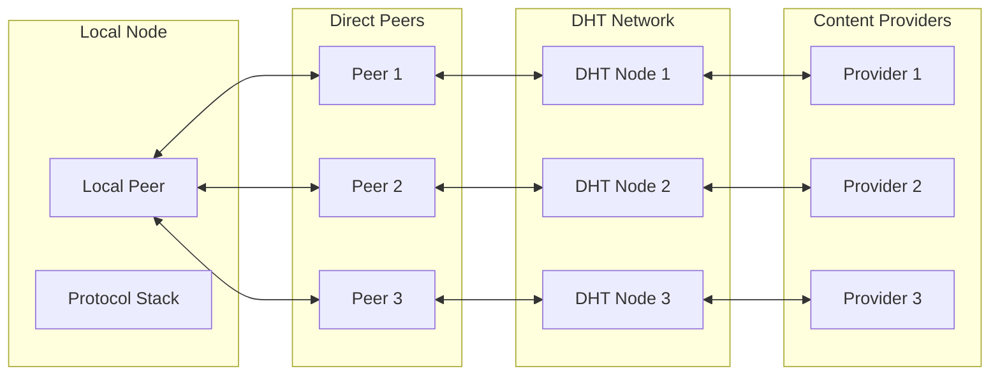

## Security Model

### Trust Boundaries

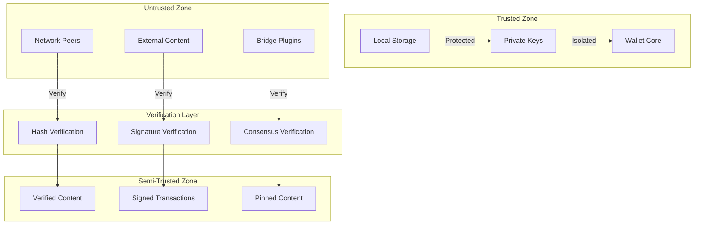

### Cryptographic Architecture

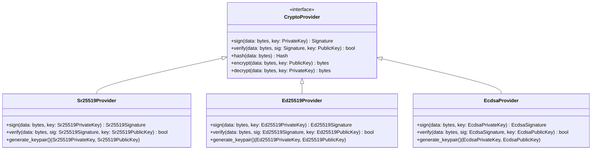

## Storage Architecture

### Local Storage Hierarchy

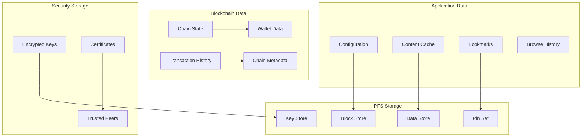

### Data Persistence Strategy

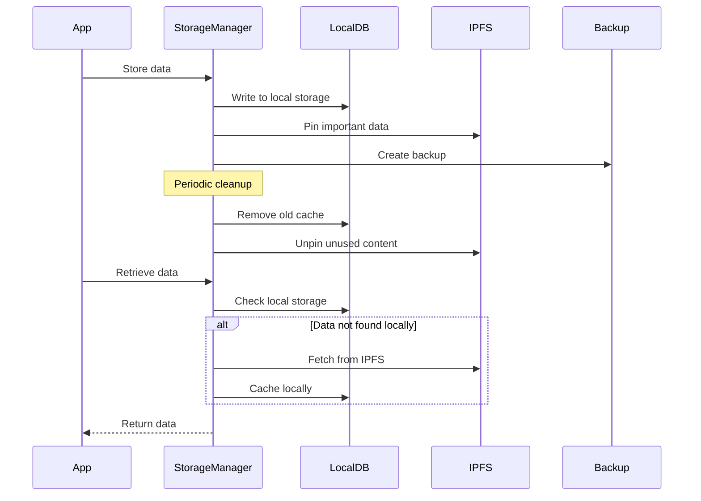

## Component Interactions

### Inter-Component Communication

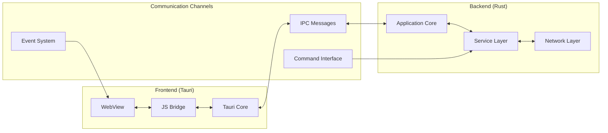

### Event Flow Architecture

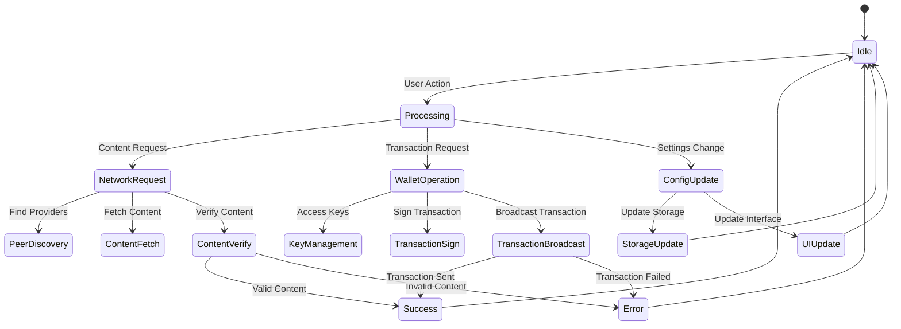

## Design Decisions

### 1. Modular Architecture
- **Rationale**: Enables independent development and testing of components
- **Trade-offs**: Increased complexity vs. maintainability
- **Implementation**: Rust workspace with separate crates

### 2. libp2p for Networking
- **Rationale**: Mature, well-tested P2P networking stack
- **Benefits**: Multi-transport, security, protocol extensibility
- **Challenges**: Learning curve, dependency management

### 3. Tauri for UI
- **Rationale**: Native performance with web technologies
- **Benefits**: Cross-platform, security, small bundle size
- **Trade-offs**: Limited to desktop platforms initially

### 4. Embedded Light Clients
- **Rationale**: Eliminates dependency on external RPC providers
- **Benefits**: True decentralization, privacy, reliability
- **Challenges**: Resource usage, sync time, complexity

## Performance Considerations

### Resource Management

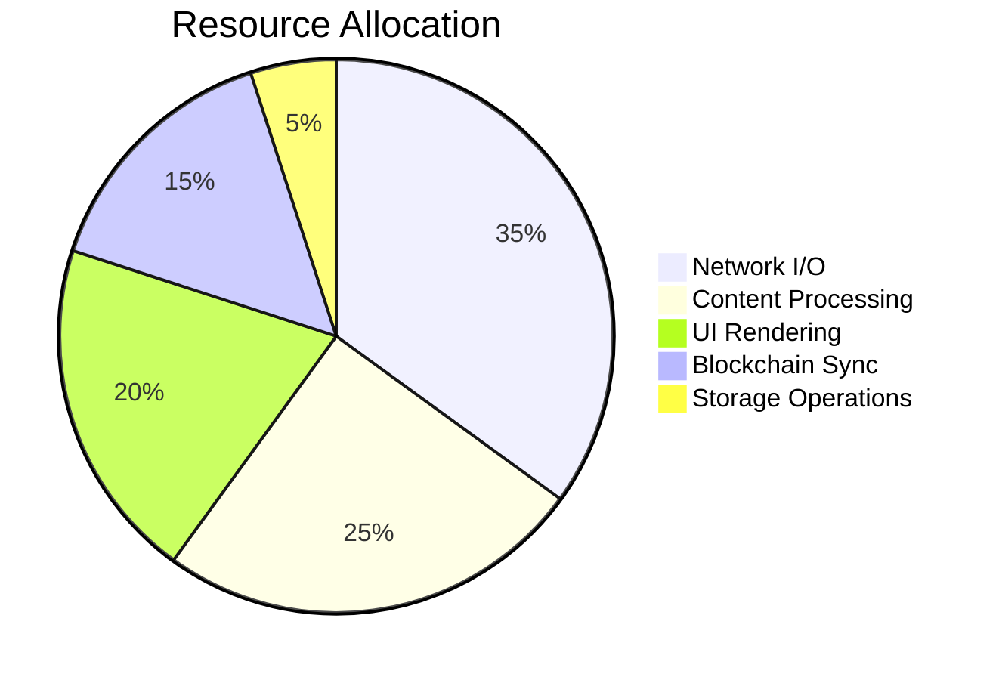

### Optimization Strategies

1. **Lazy Loading**: Load components only when needed
2. **Content Caching**: Aggressive caching of frequently accessed content
3. **Peer Selection**: Optimize peer selection for performance
4. **Background Processing**: Move heavy operations to background threads
5. **Memory Management**: Efficient memory usage with Rust's ownership model

## Future Architecture Considerations

### Scalability Improvements
- Mobile platform support
- WebAssembly plugins
- Advanced caching strategies
- Distributed computation

### Security Enhancements
- Hardware security module integration
- Zero-knowledge proof verification
- Advanced privacy features
- Formal verification of critical components

This architecture provides a solid foundation for a truly decentralized browser while maintaining performance, security, and user experience standards.
