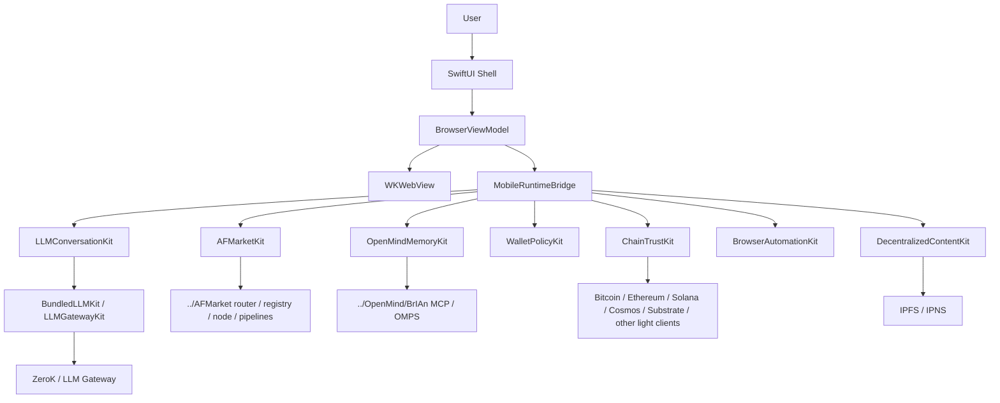

# dBrowser Current Architecture And Plan

This is the single source of truth for the current dBrowser architecture and implementation plan.

The product has transitioned to Swift completely. The current app is the native Swift app under `swift/dBrowser`. Any capability that exists only in the old Rust/Tauri runtime is historical implementation evidence, not current product functionality. Rust-only functionality must be recreated as Swift packages and integrated with the Swift app before it counts as supported.

## Current Product Boundary

Current product:

- Native Swift app: `swift/dBrowser`.
- SwiftUI shell: `ContentView.swift`.
- Browser state and navigation: `BrowserViewModel.swift` and `BrowserModels.swift`.
- Web rendering: `BrowserWebView.swift` wrapping `WKWebView`.
- Runtime integration boundary: `RuntimeBridge.swift`.
- AFMarket service client: `AFMServicesClient.swift`.
- Local MLX model selection: `BundledLLM.swift`.
- Unit tests: `swift/dBrowser/dBrowserTests/dBrowserTests.swift`.

Legacy/reference only:

- Rust crates under `crates/`.
- Tauri GUI and runtime frontend.
- Old Rust agent runtime, wallet, IPFS, p2p, updater, AFM, and light-client code.
- Old Node service docs unless they describe external contracts the Swift app still calls.

The migration rule is simple: if Swift cannot call it through a Swift package or a documented service contract, it is not current architecture.

## Product Goal

dBrowser is a native Swift browser and agent surface for decentralized browsing, local-first AI, governed personal memory, AFMarket task execution, and chain-verified wallet/protocol state.

The app should:

- Load normal web pages in `WKWebView`.
- Resolve IPFS, IPNS, ENS, and other decentralized addresses through verified light-client paths where possible, with clearly labeled gateway fallback.
- Provide a desktop-class LLM conversation UI similar in scope to Claude Desktop or ChatGPT Desktop.
- Let the user switch the active LLM at any point while preserving conversation context.
- Let the LLM surface read and operate the real active page through typed, approval-gated automation.
- Use local MLX models by default when they are suitable.
- Route larger or specialized work through AFMarket runner packs.
- Retrieve and write personal memory only through BrIAn/OpenMind MCP policy gates.
- Keep wallet signing, spend policy, memory writeback, downloads, and destructive page actions behind explicit user approval.
- Surface proof, attestation, settlement, and light-client trust state in the UI.

## Current Swift App

The current Swift app already has a usable shell:

| Surface | Current implementation | Status |
| --- | --- | --- |
| Browser chrome | `ContentView.swift` renders toolbar, address bar, tab strip, status bar, home, panels | Current |
| Web rendering | `BrowserWebView.swift` owns a `WKWebView`, navigation delegate, back/forward/reload/stop commands | Current |
| Tabs/history/bookmarks | `BrowserViewModel.swift` manages in-memory tabs, history, bookmarks, autocomplete | Current |
| URL resolution | `BrowserURLResolver` accepts HTTP/HTTPS, blocks unsupported schemes, delegates IPFS/IPNS/ENS to runtime bridge | Current |
| Runtime status | `MobileRuntimeBridge` exposes feature states for browsing, decentralized protocols, AFM, Copilot, wallet, downloads | Current |
| AFM service checks | `AFMServicesClient` checks router, registry, and pipelines health and calls `/route`, `/packs`, `/jobs` | Prototype |
| Copilot | `runCopilot` routes through AFM services when available, otherwise returns deterministic local fallback | Prototype |
| Wallet | Local typed policy simulator for connect/disconnect/spend decision | Prototype |
| Downloads | Native `URLSession` download tracking with queued/downloading/completed/cancelled/failed states | Current |
| Bundled LLM | Gemma 4 E2B IT 4-bit MLX through `mlx-swift-lm` packages | Current selection, inference integration next |

Current limitations:

- No typed `WKWebView` automation bridge yet.
- No DOM snapshot, click/type/scroll/wait action channel yet.
- Copilot run state is a single result, not a conversation-first streamed/cancellable run ledger.
- No model registry or mid-conversation model switching yet.
- History/bookmarks/workflows are in-memory.
- Decentralized protocols use gateway fallback today.
- Wallet and chain trust are policy simulators until Swift light clients and signing are integrated.

## Swift System Map


```mermaid
graph TD
  User["User"] --> SwiftUI["SwiftUI Shell"]
  SwiftUI --> ViewModel["BrowserViewModel"]
  ViewModel --> WebView["WKWebView"]
  ViewModel --> Runtime["MobileRuntimeBridge"]

  Runtime --> AFM["AFMarketKit"]
  Runtime --> Memory["OpenMindMemoryKit"]
  Runtime --> Chain["ChainTrustKit"]
  Runtime --> Wallet["WalletPolicyKit"]
  Runtime --> Conversation["LLMConversationKit"]
  Conversation --> LLM["BundledLLMKit / LLMGatewayKit"]
  Runtime --> Automation["BrowserAutomationKit"]
  Runtime --> Content["DecentralizedContentKit"]

  AFM --> AFMarket["../AFMarket router / registry / node / pipelines"]
  Memory --> BrIAn["../OpenMind/BrIAn MCP / OMPS"]
  Chain --> LightClients["Bitcoin / Ethereum / Solana / Cosmos / Substrate / other light clients"]
  LLM --> ZeroK["ZeroK / LLM Gateway"]
  Content --> IPFS["IPFS / IPNS"]
```

The Swift app owns UI, state, approvals, and user-visible trust labels. Swift packages provide reusable capability boundaries. External projects provide service contracts, but the app should not depend on hidden Rust-only implementation paths.

## Package Architecture

Create Swift packages under `swift/Packages` as capabilities move out of old Rust-only code.

| Package | Responsibility | Recreates or integrates |
| --- | --- | --- |
| `BrowserAutomationKit` | Typed `WKWebView` request/response bridge, DOM snapshots, page actions, timeouts, redaction | Old browser automation and DOM action concepts |
| `AgentRuntimeKit` | Copilot runs, tool calls, approvals, cancellation, ledger, credit accounting, saved workflows | Old agent-core and ai-agent runtime |
| `LLMConversationKit` | Persistent conversations, messages, model registry, provider-neutral context ledger, model-switch events, prompt rendering | Old LLM/Copilot UX concepts, rebuilt for Swift |
| `AFMarketKit` | AFMarket marketplace, router, registry, node install/dispatch, leases, attestation, proof, settlement models | `../AFMarket` contracts and old AFM Rust crates |
| `OpenMindMemoryKit` | MCP client configuration, OMPS resources/tools, governed recall, step-up, memory writeback | `../OpenMind/BrIAn` OpenMind MCP packages |
| `ChainTrustKit` | Shared chain trust registry, light-client status, fallback labels, proof result models | Old blockchain/light-client concepts |
| `BitcoinLightClientKit` | Bitcoin SPV or compact-filter verification | Old `btc-light` concepts, implemented natively for Swift |
| `EthereumLightClientKit` | Ethereum and EVM-family light clients, ENS proofs, wallet state proofs | Old `eth-light` concepts |
| `SolanaLightClientKit` | Solana proof verification and finalized state checks | New Swift package |
| `TendermintLightClientKit` | Cosmos SDK and Tendermint client verification | New Swift package |
| `SubstrateLightClientKit` | Polkadot/Substrate verification, likely through Swift-compatible smoldot integration | Old Substrate ideas |
| `WalletPolicyKit` | Local keys, Secure Enclave, WalletConnect, spend/signature policy, approvals | Old walletd and wallet store concepts |
| `DecentralizedContentKit` | IPFS/IPNS resolution, content verification, gateway fallback labels, future embedded node | Old IPFS/p2p concepts |
| `BundledLLMKit` | Local MLX model discovery, loading, inference, token accounting | Current `BundledLLM.swift` extracted into package |
| `LLMGatewayKit` | ZeroK/LLM Gateway encrypted envelopes, token-class padding, usage tickets, provider boundary labels | ZeroK/LLM Gateway contracts |
| `UpdateDistributionKit` | Signed update manifests, content-addressed release fetch, integrity checks | Old updater concepts |
| `DiagnosticsKit` | Local logs, test diagnostics, user-exportable support bundles, telemetry policy | Old telemetry concepts |

Package rule:

- No package may silently use an RPC/gateway as the trust root if the UI says verified.
- Mock, local, gateway, remote, and proof-verified modes must be distinct model states.
- Every package needs unit tests and fixture coverage before UI wiring.

## Current External Integrations

### AFMarket

AFMarket lives in `../AFMarket` and is the source of truth for runner-pack discovery, expert routing, node dispatch, attested AFM execution, and ZK settlement.

Current Swift app surface:

- `AFMServiceEndpointConfiguration` defaults to local router, registry, and pipelines endpoints.
- `AFMServicesClient` checks `/health`, reads `/packs`, posts `/route`, and posts `/jobs`.
- `MobileRuntimeBridge.runCopilot` uses AFM services when available.

Target Swift package:

- `AFMarketKit`.

Required contracts:

- Marketplace UI and pack API from `../AFMarket/afm-marketplace-starter`.
- Runner pack schemas from `../AFMarket/afm-marketplace-starter/lib/schema.ts` and `../AFMarket/pipelines/src/types.ts`.
- Registry schemas from `../AFMarket/registry/src/schemas.ts`.
- Router schemas from `../AFMarket/router/src/schemas.ts`.
- Node install API from `../AFMarket/node/src/http.rs`.
- API contracts from `../AFMarket/docs/api-contracts.md`.
- EVM escrow and verifier contracts from `../AFMarket/contracts`.
- Swift attested run shape from `../AFMarket/ZKAI/ZKAI/AFMTaskRunner.swift`.

Implementation plan:

- Add AFMarket endpoint configuration for marketplace, registry, router, node agent, and settlement chain.
- Add Codable models for packs, registry bundles, experts, router tasks, routes, node installs, result envelopes, proofs, and settlement metadata.
- Add a marketplace surface for browsing and installing runner packs.
- Install selected packs through `POST /packs/install`.
- Route Copilot runs through AFMarket when a compatible pack is selected.
- Reflect lease, dispatch, attestation, proof, and settlement status in Copilot activity.
- Bind AFMarket proof and escrow status into credit metering and chain trust UI.

Issue: #69.

### BrIAn And OpenMind MCP

BrIAn lives in `../OpenMind/BrIAn` and is the personal memory store and OpenMind control plane. dBrowser must interact with it through MCP/OMPS contracts, never by reading BrIAn storage directly.

Target Swift package:

- `OpenMindMemoryKit`.

Required contracts:

- Swift MCP client and OMPS client from `../OpenMind/BrIAn/Packages/OpenMindMCPClient`.
- Swift MCP server and OMPS core from `../OpenMind/BrIAn/Packages/OpenMindMCPServer`.
- MCP resources such as `mind://profile`, `mind://state`, `mind://continuity`, `mind://memories`, `mind://capabilities`, posture, grants, authorizations, and recommendations.
- MCP tools such as `mind.search_memories`, `mind.retrieve_evidence_bundle`, `mind.add_memory`, `event.append`, `proposal.create`, `gateway.evaluate_access_intent`, and step-up grant tools.

Implementation plan:

- Add BrIAn/OpenMind MCP endpoint configuration for stdio and HTTP transports.
- Negotiate capabilities before any recall or writeback.
- Build access intents from prompt, page URL, page snapshot metadata, requested purpose, sensitivity ceiling, and output mode.
- Evaluate access before recall through `gateway.evaluate_access_intent`.
- Retrieve only policy-gated memory context and surface allowed, redacted, blocked, and unavailable states.
- Require explicit user approval for memory writeback.
- Attach run ID, tab ID, page snapshot commitment, idempotency key, source metadata, and base revision where available.
- Reflect BrIAn posture, continuity, grants, authorizations, and step-up state in Copilot activity.

Issue: #70.

### ZeroK And LLM Gateway

ZeroK is the privacy and proof-oriented LLM gateway path. The Swift app currently exposes `https://zerok.cloud` and `https://llmos.showntell.dev` as runtime gateway starting points.

Target Swift packages:

- `LLMGatewayKit`.
- `BundledLLMKit`.

Implementation plan:

- Use local MLX models first when suitable.
- Send only selected and redacted page context to a gateway.
- Use encrypted envelopes, token-class padding, usage tickets, replay protection, and user-visible provider boundary labels.
- Keep browser history, personal memory, and tab state local unless the user explicitly shares context.
- Label provider exposure honestly: upstream providers may correlate decrypted prompt content and timing unless confidential inference is added.

### Blockchain Light Clients

The Swift runtime should not treat RPC or HTTP gateways as trust roots for chain-backed state. The app needs a shared `ChainTrustKit` registry first, then chain-specific Swift light-client packages.

Shared trust states:

- `unavailable`
- `syncing`
- `verified`
- `proofChecked`
- `rpcFallback`
- `gatewayFallback`
- `stale`
- `failed`

Each chain adapter must expose:

- chain ID and network name
- sync height or checkpoint
- trust source
- supported proof types
- last verification error
- fallback reason

Required chain packages:

- Bitcoin SPV or compact-filter client (#59).
- Ethereum and EVM-family clients (#60).
- Solana verification (#61).
- Cosmos SDK and Tendermint clients (#62).
- Polkadot/Substrate client (#63).
- Avalanche verification (#64).
- TRON light-client or proof-verified fallback (#65).
- XRP Ledger verification (#66).
- Sui and Aptos Move-chain clients (#67).

Bitcoin note:

- Bitcoin Core is a full-node client, not the embeddable Swift light client.
- Bitcoin does not ship a single official embeddable Swift light client with Bitcoin Core.
- A mobile Swift app should use SPV or compact-filter verification.
- A pruned/full Bitcoin Core node can be an optional desktop/server companion, but it must not be represented as the iOS embedded runtime.
- As of May 2026, bitcoin.org lists unpruned Bitcoin Core storage as over 750 GB and pruned storage as around 7 GB, after still downloading and validating the chain.

### KeyMeIn

`KeyMeIn` is not an active dependency in the current Swift app.

Adopt it only if dBrowser needs production attestation-gated signing, identity-gated authorization, threshold signing, JWKS receipt verification, or an external signing policy system. The integration point should be `WalletPolicyKit` or gateway authorization, not browser rendering.

## LLM Conversation And Page Automation Plan

The key gap is a first-class Swift LLM surface that can hold real conversation context, switch models without losing that context, and operate the active `WKWebView` page through approved typed actions.

The target UI should feel like a native desktop chat app:

- Persistent conversation list.
- Main message timeline with streamed assistant output.
- Composer with model picker, page-context attachment, file/context attachments, and stop/regenerate controls.
- Visible run activity for tool calls, memory access, AFMarket dispatch, chain verification, and approvals.
- Per-message model identity and boundary labels: local MLX, ZeroK/LLM Gateway, AFMarket runner pack, or other provider.
- Clear empty, loading, offline, provider-failed, and context-compressed states.

Context continuity rule:

- Conversation history is stored as a provider-neutral ledger.
- The ledger records user messages, assistant messages, tool calls, page snapshots, memory citations, approvals, run events, model choices, and model-switch events.
- Switching models appends an event; it does not rewrite canonical history.
- Each model adapter renders prompts from the same canonical ledger.
- When a target model has a smaller context window, the app creates an explicit summary artifact that remains linked to the source messages.
- Context compression is visible in run activity and must not silently discard approvals, memory denials, wallet decisions, or page-action history.
- Tool permissions and approval gates do not change just because the user changes models.

P0 implementation sequence:

1. Add `LLMConversationKit` with persistent conversations, messages, runs, model registry, and model-switch events.
2. Add provider-neutral context ledger and adapter-specific prompt rendering.
3. Add context-window accounting and explicit summary artifacts for smaller model windows.
4. Add `BrowserAutomationKit` with typed tab-scoped command/results.
5. Add DOM query extraction with strict payload caps and redaction.
6. Add typed page actions: click, type, focus, submit, scroll, navigate, wait, stop.
7. Add page snapshots for conversation context.
8. Replace single-result Copilot execution with streamed `CopilotRun` state.
9. Add cancellation and user takeover.
10. Meter credits only when model work happens.

Approval gates:

- Form submit.
- Downloads.
- Wallet signing or spend.
- Cross-origin navigation.
- Destructive or purchase-like clicks.
- Credential or password fields.
- Memory writeback.
- AFMarket settlement.

Issues: #50 through #58 and #72.

## Swift Recreation Of Rust-Only Functionality

Rust-only functionality must be recreated as Swift packages and integrated with `swift/dBrowser`.

| Legacy Rust/Tauri area | Swift replacement | Required integration |
| --- | --- | --- |
| `crates/gui` Tauri browser shell | Existing SwiftUI/WKWebView shell | Keep improving `swift/dBrowser` only |
| `crates/agent-core`, `crates/ai-agent` | `AgentRuntimeKit` and `LLMConversationKit` | Conversations, model switching, Copilot runs, approvals, ledger, tool routing, credits |
| `crates/ipfs`, `crates/p2p` | `DecentralizedContentKit` | IPFS/IPNS resolution and content verification |
| `crates/blockchain`, `crates/walletd` | `WalletPolicyKit` and `ChainTrustKit` | Wallet state, signing, broadcast, proof labels |
| `crates/btc-light`, `crates/eth-light` | chain-specific Swift light-client packages | Verified chain state in the runtime UI |
| `crates/afm-node`, `crates/afm-zkvm` | `AFMarketKit` plus external AFMarket node contracts | Pack install, dispatch, attestation, proof, settlement |
| `crates/updater` | `UpdateDistributionKit` | Signed/content-addressed update checks if needed |
| Rust telemetry/security helpers | `DiagnosticsKit` and Swift app policy | Local diagnostics and privacy controls |
| Tauri commands and TypeScript UI | SwiftUI views and Swift async clients | No Tauri command bridge in current product |

Do not keep dual product paths. The Rust code can be mined for behavior, contracts, fixtures, and tests, but the deliverable is Swift package code and Swift app integration. Reference Rust modules should be named from issues when they are useful, then treated as source material rather than runtime dependencies.

## Data And Trust Boundaries

| Boundary | Rule |
| --- | --- |
| Web content to app | `WKWebView` loads only allowed URL schemes. Future automation uses audited scripts only, never arbitrary model JavaScript. |
| Copilot to page | Typed commands, tab IDs, timeouts, redaction, approvals, and cancellation. |
| Copilot to memory | OpenMind access intent first; approved context only; blocked memory stays visible as a notice without hidden content. |
| Copilot to AFMarket | Pack, lease, dispatch, attestation, proof, and settlement states are visible. Mock states are labeled. |
| App to LLM | Conversation context is provider-neutral. Local MLX first where possible. Gateway calls carry selected/redacted context only. |
| App to chain | Light-client verified or explicitly labeled fallback. RPC fallback is transport, not trust. |
| App to wallet | Secure Enclave, WalletConnect, or policy-backed signing; spend and signature requests require explicit approval. |

## User Flows

Normal browsing:

1. User enters an HTTP/HTTPS address or search terms.
2. `BrowserURLResolver` normalizes the input.
3. `BrowserWebView` loads the URL through `WKWebView`.
4. Navigation updates flow back into Swift tab state.

Decentralized address:

1. User enters IPFS, IPNS, ENS, or compatible name.
2. Swift blocks direct WebKit loading for unsupported schemes.
3. `MobileRuntimeBridge` resolves through current gateway fallback.
4. Future `DecentralizedContentKit` and chain packages replace fallback with verified resolution.
5. UI labels the trust source.

LLM conversation:

1. User opens the LLM surface with or without an active tab.
2. User selects a model or keeps the current default.
3. App stores messages and selected context in the provider-neutral ledger.
4. App builds a page snapshot and access intent when browser context is attached.
5. BrIAn/OpenMind gates personal memory.
6. AFMarket routes to a runner pack when selected and available.
7. Local MLX or gateway model executes the approved prompt.
8. User may switch models at any point; the next turn is rendered from the same ledger.
9. Page actions, memory writes, downloads, wallet operations, and settlement require approval.
10. Run activity shows model, events, usage, trust state, and final output.

Memory writeback:

1. User explicitly asks to remember, correct, or save an event.
2. Swift creates a write proposal with source metadata.
3. BrIAn/OpenMind applies policy and step-up if needed.
4. The app records success, denial, or review-required state.

AFMarket task:

1. User selects or accepts an AFMarket runner pack.
2. Swift installs or verifies the pack through the configured node/market contracts.
3. Router selects an expert or pack.
4. Node dispatches and executes.
5. Attestation/proof/settlement states feed back to Copilot activity and wallet UI.

## Implementation Roadmap

P0: Swift shell and automation

- Keep `swift/dBrowser` as the only current app.
- Add the desktop-style LLM conversation UI and model-switching context ledger.
- Add `BrowserAutomationKit`.
- Add page snapshots and DOM actions.
- Add streamed Copilot runs, cancellation, approvals, and credit metering.
- Persist history, bookmarks, workflows, and run records locally.

P1: Memory, AFMarket, and local LLM

- Add `OpenMindMemoryKit` for BrIAn MCP.
- Add `AFMarketKit` for pack discovery, install, route, dispatch, proof, and settlement.
- Extract `BundledLLMKit` and wire real MLX inference for Gemma 4 E2B IT 4-bit.
- Add `LLMGatewayKit` for ZeroK/LLM Gateway calls.

P2: Decentralized trust

- Add `ChainTrustKit`.
- Add Bitcoin, Ethereum/EVM, Solana, Cosmos/Tendermint, Substrate, Avalanche, TRON, XRPL, Sui, and Aptos adapters.
- Replace IPFS/IPNS/ENS gateway fallback with verified Swift packages where possible.
- Add wallet signing with Secure Enclave, WalletConnect, or explicit external signer policies.

P3: Distribution and hardening

- Add signed/content-addressed updates if still needed.
- Add diagnostics export.
- Add UI tests around high-risk approval flows.
- Remove or archive legacy Rust/Tauri code once Swift parity is complete.

## Verification

Required validation for docs and Swift app changes:

```sh
git diff --check
LC_ALL=C grep -n '[^ -~]' docs/ARCHITECTURE.md docs/README.md README.md STATUS.md STRAWBERRY_SWIFT.md || true
xcodebuild build -project swift/dBrowser/dBrowser.xcodeproj -scheme dBrowser -destination 'platform=macOS'
xcodebuild test -project swift/dBrowser/dBrowser.xcodeproj -scheme dBrowser -destination 'platform=macOS,arch=arm64' -only-testing:dBrowserTests
```

Rust, pnpm, and Tauri commands are not current-product validation gates anymore. Run them only when mining or retiring legacy code.

## Documentation Policy

This file is the canonical architecture and plan. `docs/README.md` points here. Files under `docs/ai/` are supporting metadata for tools, not narrative documentation.

When architecture changes:

- Update this file first.
- Update linked GitHub issues when scope changes.
- Do not add parallel narrative docs.
- If a detail only applies to legacy Rust/Tauri code, label it as legacy or omit it.
