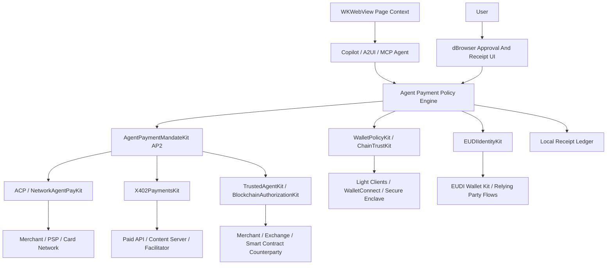
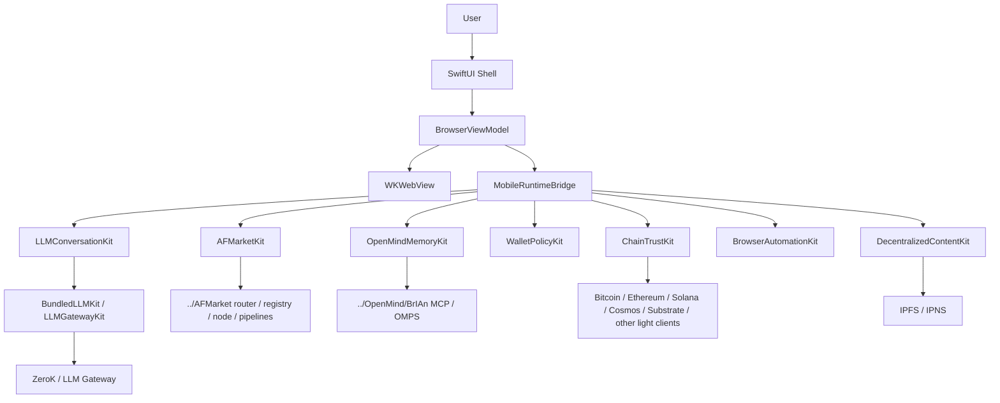

# dBrowser Current Architecture And Plan

This is the single source of truth for the current dBrowser architecture and implementation plan.

The product has transitioned to Swift completely. The current app is the native Swift app under `swift/dBrowser`. Any capability that exists only in the old Rust/Tauri runtime is historical implementation evidence, not current product functionality. Rust-only functionality must be recreated as Swift packages and integrated with the Swift app before it counts as supported.

## Current Product Boundary

Current product:

- Native Swift app: `swift/dBrowser`.
- SwiftUI shell: `ContentView.swift`.
- Browser state and navigation: `BrowserViewModel.swift` and `BrowserModels.swift`.
- Web rendering: `BrowserWebView.swift` wrapping `WKWebView`.
- Ad and tracker blocking: `BrowserAdBlocker.swift` compiles local WebKit content-blocker rules.
- Runtime integration boundary: `RuntimeBridge.swift`.
- AFMarket service client: `AFMServicesClient.swift`.
- Local MLX model selection: `BundledLLM.swift`.
- Unit tests: `swift/dBrowser/dBrowserTests/dBrowserTests.swift`.

Legacy/reference only:

- Rust crates under `crates/`.
- Tauri GUI and runtime frontend.
- Old Rust agent runtime, wallet, IPFS, p2p, updater, AFM, and light-client code.
- Old Node service docs unless they describe external contracts the Swift app still calls.

The migration rule is simple: if Swift cannot call it through a Swift package or a documented service contract, it is not current architecture.

## Product Goal

dBrowser is a native Swift browser and agent surface for decentralized browsing, local-first AI, governed personal memory, AFMarket task execution, and chain-verified wallet/protocol state.

The strategic north star is to make dBrowser the Web3 and AI browser to beat: a native browser where AI agents can research, negotiate, prepare forms, compare carts, call tools, and coordinate payment flows, but cannot move money or disclose identity without typed policy, verified identity context, explicit user approval, and a durable local receipt.

The app should:

- Load normal web pages in `WKWebView`.
- Block common advertising and tracker requests locally by default while preserving localhost and decentralized adapter routes.
- Resolve IPFS, IPNS, ENS, and other decentralized addresses through verified light-client paths where possible, with clearly labeled gateway fallback.
- Provide a desktop-class LLM conversation UI similar in scope to Claude Desktop or ChatGPT Desktop.
- Let the user switch the active LLM at any point while preserving conversation context.
- Let the LLM surface read and operate the real active page through typed, approval-gated automation.
- Use local MLX models by default when they are suitable.
- Route larger or specialized work through AFMarket runner packs.
- Retrieve and write personal memory only through BrIAn/OpenMind MCP policy gates.
- Keep wallet signing, spend policy, memory writeback, downloads, and destructive page actions behind explicit user approval.
- Surface proof, attestation, settlement, and light-client trust state in the UI.
- Support EUDI Wallet-compatible identity and attestation flows as a user-controlled credential boundary.
- Support agentic payment protocols only through typed intents, signed/hashed authorization artifacts, revocation, and approval receipts.

## EUDI Wallet And Agentic Payments Plan

Tracker: https://github.com/advatar/Browser/issues/138

Primary sources inspected on 2026-06-06:

- European Commission European Digital Identity overview: https://commission.europa.eu/topics/digital-economy-and-society/european-digital-identity_en
- EUDI Wallet Architecture and Reference Framework: https://eudi.dev/latest/architecture-and-reference-framework-main/
- EUDI Wallet ARF repository: https://github.com/eu-digital-identity-wallet/eudi-doc-architecture-and-reference-framework
- EUDI iOS Wallet Kit: https://github.com/eu-digital-identity-wallet/eudi-lib-ios-wallet-kit
- Google AP2 announcement and repository: https://cloud.google.com/blog/products/ai-machine-learning/announcing-agents-to-payments-ap2-protocol and https://github.com/google-agentic-commerce/AP2
- Visa Trusted Agent Protocol overview and specification: https://developer.visa.com/capabilities/trusted-agent-protocol/overview and https://developer.visa.com/capabilities/trusted-agent-protocol/trusted-agent-protocol-specifications/
- Notabene Transaction Authorization Protocol: https://notabene.id/tap
- Stripe/OpenAI Agentic Commerce Protocol: https://docs.stripe.com/agentic-commerce/acp and https://github.com/agentic-commerce-protocol/agentic-commerce-protocol
- x402 payment standard and docs: https://www.x402.org/ and https://docs.x402.org/introduction
- Mastercard Agent Pay and agentic commerce standards notes: https://www.mastercard.com/us/en/news-and-trends/press/2025/april/mastercard-unveils-agent-pay-pioneering-agentic-payments-technology-to-power-commerce-in-the-age-of-ai.html and https://www.mastercard.com/us/en/news-and-trends/stories/2026/agentic-commerce-rules-of-the-road.html

Terminology:

- "A2P" appears in market commentary, but the canonical Google artifact is AP2, the Agent Payments Protocol.
- "TAP" is overloaded. Visa Trusted Agent Protocol handles agent recognition and merchant verification. Notabene Transaction Authorization Protocol handles blockchain pre-settlement authorization between counterparties.
- EUDI Wallet is an identity and attestation wallet framework, not a payment wallet by itself. It matters because agentic payments need strong identity, user authentication, selective disclosure, signatures, and revocable delegation.

Protocol map:

| Layer | Source | What It Gives dBrowser | First Adapter |
| --- | --- | --- | --- |
| EU identity and attestations | EUDI Wallet ARF and iOS Wallet Kit | PID, attestations, OpenID4VCI issuance, OpenID4VP presentation, ISO 18013-5 proximity flows, SD-JWT VC, pseudonyms, and strong user authentication use cases | `EUDIIdentityKit` |
| Agent payment authorization | Google AP2 | Intent/cart/payment mandate models, signed authorization artifacts, hashes, expiry, budget, credential source, and audit trail | `AgentPaymentMandateKit` |
| Agent recognition | Visa Trusted Agent Protocol | Request signatures, key discovery, agent recognition, consumer/device identity object, and payment container verification for merchant interactions | `TrustedAgentKit` |
| Agent checkout | ACP | Agent-presented checkout, merchant order handoff, shared payment token and delegated payment flows | `AgenticCommerceKit` |
| Machine-to-machine Web3 payments | x402 | HTTP 402 payment negotiation, buyer/server/facilitator model, API/content micropayment receipts, crypto-native settlement | `X402PaymentsKit` |
| Blockchain pre-settlement authorization | Notabene TAP | Signed transfer requests, encrypted counterparty messages, authorization before blockchain settlement | `BlockchainAuthorizationKit` |
| Card-network agent payments | Mastercard Agent Pay, Visa Intelligent Commerce | Network tokenization, verifiable intent, payment passkeys, issuer/processor policy integration | `NetworkAgentPayKit` |
| Tool and agent coordination | MCP, A2A, A2UI, AFMarket | Tool discovery, agent-to-agent calls, native app surfaces, proof-backed runner packs, settlement evidence | Existing MCP/A2UI/AFMarket surfaces |

The policy architecture:


```mermaid
graph TD
  User["User"] --> Approval["dBrowser Approval And Receipt UI"]
  Page["WKWebView Page Context"] --> Copilot["Copilot / A2UI / MCP Agent"]
  Copilot --> Policy["Agent Payment Policy Engine"]
  Approval --> Policy
  Policy --> Identity["EUDIIdentityKit"]
  Policy --> Wallet["WalletPolicyKit / ChainTrustKit"]
  Policy --> Mandates["AgentPaymentMandateKit AP2"]
  Mandates --> Commerce["ACP / NetworkAgentPayKit"]
  Mandates --> X402["X402PaymentsKit"]
  Mandates --> TAP["TrustedAgentKit / BlockchainAuthorizationKit"]
  Wallet --> Chains["Light Clients / WalletConnect / Secure Enclave"]
  Identity --> EUDI["EUDI Wallet Kit / Relying Party Flows"]
  Commerce --> Merchant["Merchant / PSP / Card Network"]
  X402 --> Service["Paid API / Content Server / Facilitator"]
  TAP --> Counterparty["Merchant / Exchange / Smart Contract Counterparty"]
  Policy --> Receipt["Local Receipt Ledger"]
```

Safety invariants:

- No model can directly spend, sign, submit, broadcast, tokenize, or disclose identity.
- Every payment-capable action must have a typed intent, merchant or counterparty, amount or maximum amount, currency or asset, expiry, recurrence state, credential source, and revocation path.
- Every approval must bind to page snapshot hash, cart or transfer hash, mandate hash, wallet/account, chain/network, identity credential, model, tool, connector, and user action.
- Recurring or autonomous payments require explicit opt-in, spend caps, cooldowns, failure backoff, next-run preview, and one-click revocation.
- Payment approvals must be invalidated by cart mutation, recipient mutation, price increase beyond policy, chain/network change, credential change, or prompt-injection risk.
- Secrets stay in Keychain, Secure Enclave, WalletConnect, certified wallet flows, or approved provider vaults. dBrowser should not store card PANs.
- Mock, fixture, sandbox, local, gateway, provider, verified, revoked, and failed states must be distinct in models and UI.

Initial Swift models:

- `AgentPaymentIntent`: objective normalized into amount, merchant/counterparty, allowed categories, currency/asset, expiry, recurrence, and risk posture.
- `AgentPaymentCart`: item, price, tax, shipping, merchant, refund, delivery, checkout, and source-page hash.
- `AgentPaymentMandate`: AP2-style intent/cart/payment mandate envelope with signer, hash, expiry, scope, credential reference, and revocation state.
- `AgentPaymentProtocol`: `ap2`, `acp`, `x402`, `visaTrustedAgent`, `notabeneTap`, `mastercardAgentPay`, `manualApproval`.
- `EUDICredentialPresentation`: relying party, requested attributes, purpose, legal basis text, selective-disclosure result, pseudonym mode, and wallet approval state.
- `AgentTrustAttestation`: agent identifier, request signature, key source, payment scheme, verification result, and failure reason.
- `PaymentPolicyDecision`: allow, ask, deny, step-up, revise, revoke, or expired.
- `PaymentReceipt`: local immutable receipt binding identity, wallet, page, model, connector, mandate, cart, transaction, and user approval metadata.
- `RecurringPaymentPolicy`: cap, cadence, merchant allowlist, revocation, cooldown, last-run, next-run, failure, and notification state.

Product surface:

- Wallet panel becomes "Wallet, Identity & Payments" or gains an adjacent Identity/Payments tab.
- Copilot and A2UI apps can propose payment intents, but they open a review sheet instead of submitting checkout directly.
- Review sheet shows merchant/counterparty, amount, asset/currency, recurrence, identity attributes requested, model/tool provenance, page/cart hash, network trust, and exact approval consequence.
- Receipt ledger shows approved, denied, expired, revoked, failed, refunded, and settled states.
- MCP/A2UI apps declare payment capability requirements in the same style as wallet and chain grants.

Implementation phases:

1. Add Swift-only protocol models and fixtures for EUDI credential requests, AP2 mandates, ACP checkout drafts, x402 payment requirements, Visa TAP signatures, Notabene TAP transfer requests, and network-agent-pay abstractions.
2. Add tests for normalization, redaction, hash binding, policy decisions, recurring limits, expiry, revocation, and receipt generation.
3. Add a payment intent review surface in the Wallet panel and Copilot flow.
4. Spike `EUDIIdentityKit` with EUDI iOS Wallet Kit where licensing and platform targets fit; keep certification status explicit.
5. Implement local AP2, ACP, x402, Visa TAP, Notabene TAP, and Mastercard Agent Pay fixtures before any provider or sandbox integration.
6. Add sandbox-only clients where developer access is available; avoid real payment method collection unless handled by a certified or PCI-ready provider flow.
7. Add an agentic payments benchmark lane covering EUDI presentation, AP2 human-present cart approval, AP2 capped budget approval/denial, x402 paid API access, and Notabene TAP-style transfer authorization.

Compliance notes:

- Until certification and national wallet-provider requirements are understood, dBrowser should present EUDI support as relying-party/client integration and test harness work, not certified wallet-provider status.
- Card-network and PSP integrations must avoid storing PANs and must use provider-hosted, tokenized, or certified flows.
- Blockchain payment flows need sanctions, Travel Rule, counterparty, and fraud policy hooks where applicable.
- Prompt injection is a financial risk. Payment policy must trust typed artifacts, hashes, signatures, and user approvals over model claims.
- Provider terms can limit signing, key publication, and merchant simulation. Each adapter needs a terms/availability state before production use.

Open decisions:

- Whether dBrowser should become an EUDI wallet provider, a wallet-compatible relying-party client, or both.
- Whether a Windows shell is required for public "at or above Strawberry" claims.
- Which payment sandboxes are available first: AP2, ACP, x402, Visa, Mastercard, Notabene, or provider-specific rails.
- Whether recurring autonomous payments should launch with deny-by-default policy only, or with scoped allowlists for low-risk paid APIs.
- How much of the payment receipt ledger should be exportable for enterprise compliance without leaking private page, identity, or wallet data.

## Current Swift App

The current Swift app already has a usable shell:

| Surface | Current implementation | Status |
| --- | --- | --- |
| Browser chrome | `ContentView.swift` renders toolbar, address bar, tab strip, status bar, home, panels | Current |
| Web rendering | `BrowserWebView.swift` owns a `WKWebView`, navigation delegate, back/forward/reload/stop commands | Current |
| Ad and tracker blocking | `BrowserAdBlocker.swift` installs a default-on `WKContentRuleList` with block, cookie-strip, cosmetic-hide, and local-route exemption rules | Current |
| Tabs/history/bookmarks | `BrowserViewModel.swift` manages in-memory tabs, history, bookmarks, autocomplete | Current |
| URL resolution | `BrowserURLResolver` accepts HTTP/HTTPS, blocks unsupported schemes, delegates IPFS/IPNS/ENS to runtime bridge | Current |
| Runtime status | `MobileRuntimeBridge` exposes feature states for browsing, decentralized protocols, AFM, Copilot, wallet, downloads | Current |
| AFM service checks | `AFMServicesClient` checks router, registry, pipelines, node, and local marketplace services; it calls route, pack, job, training, publish, and marketplace discovery APIs | Prototype |
| Copilot | The composer and App Intent handoff queue inference until fresh active-page context is validated; explicit model selection is fail-closed and AFMarket runs only when AFMarket is selected | Current context boundary; provider runtime prototype |
| Wallet | Local typed policy simulator for connect/disconnect/spend decision | Prototype |
| Downloads | Native `URLSession` download tracking with queued/downloading/completed/cancelled/failed states | Current |
| Bundled LLM | Gemma 4 E2B IT 4-bit MLX through `mlx-swift-lm` packages | Current selection, inference integration next |
| Decentralized storage handlers | `services/storage-adapters` binds the Swift localhost adapter ports and validates/proxies protocol-specific native handler requests | Local service contract |

Current limitations:

- Comet-style search and Google connectors require user-supplied service
  configuration and credentials. They do not bundle a hosted search index,
  Google OAuth client, account, or access token, and they fail visibly when that
  external configuration is absent.
- Saved and scheduled workflows share the composer's fresh-context gate and
  approval boundaries, but schedules are evaluated only while dBrowser is open;
  the app does not register an OS background task or wake itself after quit.
- Typed `WKWebView` automation, DOM snapshots, page actions, Copilot run state,
  model switching, saved workflows, Smart History, wallet/explorer state, and
  the Strawberry parity scorecard are implemented in Swift, but still need
  deeper production UX, deterministic UI coverage, and public benchmark
  artifacts.
- Browser import/switcher, companion onboarding, and benchmark proof still need
  deeper first-run UX and exported benchmark lanes. Research source retention,
  recurring workflow execution, and their production control surfaces are now
  implemented with the bounds documented below.
- Decentralized storage protocols use direct gateways where safe, then localhost
  native adapter handlers. Arbitrary bytes for heavy protocols still require the
  corresponding local daemon or backend to be configured behind
  `services/storage-adapters` until native protocol engine bundling is complete.
- Wallet and chain trust have typed policy/explorer surfaces and chain-family
  models; production signing, Secure Enclave policies, WalletConnect, and full
  Swift light-client integration remain staged work.
- EUDI Wallet, AP2, ACP, x402, Visa TAP, Notabene TAP, and Mastercard Agent Pay
  support is planned under #138 and is not yet implemented beyond this
  architecture plan.

## Swift System Map


```mermaid
graph TD
  User["User"] --> SwiftUI["SwiftUI Shell"]
  SwiftUI --> ViewModel["BrowserViewModel"]
  ViewModel --> WebView["WKWebView"]
  ViewModel --> Runtime["MobileRuntimeBridge"]

  Runtime --> AFM["AFMarketKit"]
  Runtime --> Memory["OpenMindMemoryKit"]
  Runtime --> Chain["ChainTrustKit"]
  Runtime --> Wallet["WalletPolicyKit"]
  Runtime --> Conversation["LLMConversationKit"]
  Conversation --> LLM["BundledLLMKit / LLMGatewayKit"]
  Runtime --> Automation["BrowserAutomationKit"]
  Runtime --> Content["DecentralizedContentKit"]

  AFM --> AFMarket["../AFMarket router / registry / node / pipelines"]
  Memory --> BrIAn["../OpenMind/BrIAn MCP / OMPS"]
  Chain --> LightClients["Bitcoin / Ethereum / Solana / Cosmos / Substrate / other light clients"]
  LLM --> ZeroK["ZeroK / LLM Gateway"]
  Content --> IPFS["IPFS / IPNS"]
```

The Swift app owns UI, state, approvals, and user-visible trust labels. Swift packages provide reusable capability boundaries. External projects provide service contracts, but the app should not depend on hidden Rust-only implementation paths.

## Package Architecture

Create Swift packages under `swift/Packages` as capabilities move out of old Rust-only code.

| Package | Responsibility | Recreates or integrates |
| --- | --- | --- |
| `BrowserAutomationKit` | Typed `WKWebView` request/response bridge, DOM snapshots, page actions, timeouts, redaction | Old browser automation and DOM action concepts |
| `AgentRuntimeKit` | Copilot runs, tool calls, approvals, cancellation, ledger, credit accounting, saved workflows | Old agent-core and ai-agent runtime |
| `LLMConversationKit` | Persistent conversations, messages, model registry, provider-neutral context ledger, model-switch events, prompt rendering | Old LLM/Copilot UX concepts, rebuilt for Swift |
| `AFMarketKit` | AFMarket marketplace, router, registry, node install/dispatch, leases, attestation, proof, settlement models | `../AFMarket` contracts and old AFM Rust crates |
| `OpenMindMemoryKit` | MCP client configuration, OMPS resources/tools, governed recall, step-up, memory writeback | `../OpenMind/BrIAn` OpenMind MCP packages |
| `ChainTrustKit` | Shared chain trust registry, light-client status, fallback labels, proof result models | Old blockchain/light-client concepts |
| `BitcoinLightClientKit` | Bitcoin SPV or compact-filter verification | Old `btc-light` concepts, implemented natively for Swift |
| `EthereumLightClientKit` | Ethereum and EVM-family light clients, ENS proofs, wallet state proofs | Old `eth-light` concepts |
| `SolanaLightClientKit` | Solana proof verification and finalized state checks | New Swift package |
| `TendermintLightClientKit` | Cosmos SDK and Tendermint client verification | New Swift package |
| `SubstrateLightClientKit` | Polkadot/Substrate verification, likely through Swift-compatible smoldot integration | Old Substrate ideas |
| `WalletPolicyKit` | Local keys, Secure Enclave, WalletConnect, spend/signature policy, approvals | Old walletd and wallet store concepts |
| `EUDIIdentityKit` | EUDI Wallet credential presentation, OpenID4VCI/OpenID4VP, ISO 18013-5, SD-JWT VC, pseudonym labels, relying-party fixtures | EUDI Wallet reference implementation and ARF |
| `AgentPaymentMandateKit` | AP2-style intent/cart/payment mandates, payment policy decisions, hashes, expiry, revocation, and local receipts | Google AP2 and dBrowser approval policy |
| `TrustedAgentKit` | Visa Trusted Agent Protocol request-signature verification, key-source metadata, agent recognition state, and merchant-facing trust labels | Visa TAP and HTTP message signature concepts |
| `AgenticCommerceKit` | ACP checkout drafts, merchant order handoff, shared-payment-token drafts, and checkout receipt models | Stripe/OpenAI ACP |
| `X402PaymentsKit` | HTTP 402 payment requirements, buyer/server/facilitator fixtures, wallet policy binding, and API/content micropayment receipts | x402 |
| `BlockchainAuthorizationKit` | Notabene TAP-style transfer requests, encrypted counterparty-message metadata, pre-settlement approval receipts | Notabene Transaction Authorization Protocol |
| `DecentralizedContentKit` | IPFS/IPNS resolution, content verification, gateway fallback labels, and manifest-backed engine contracts | Old IPFS/p2p concepts |
| `BundledLLMKit` | Local MLX model discovery, loading, inference, token accounting | Current `BundledLLM.swift` extracted into package |
| `LLMGatewayKit` | ZeroK/LLM Gateway encrypted envelopes, token-class padding, usage tickets, provider boundary labels | ZeroK/LLM Gateway contracts |
| `UpdateDistributionKit` | Signed update manifests, content-addressed release fetch, integrity checks | Old updater concepts |
| `DiagnosticsKit` | Local logs, test diagnostics, user-exportable support bundles, telemetry policy | Old telemetry concepts |

Package rule:

- No package may silently use an RPC/gateway as the trust root if the UI says verified.
- Mock, local, gateway, remote, and proof-verified modes must be distinct model states.
- Every package needs unit tests and fixture coverage before UI wiring.

## Current External Integrations

### AFMarket

AFMarket lives in `../AFMarket` and is the source of truth for runner-pack discovery, expert routing, node dispatch, attested AFM execution, and ZK settlement.

Current Swift app surface:

- `AFMServiceEndpointConfiguration` defaults to local router, registry, and pipelines endpoints.
- `AFMServicesClient` checks `/health`, reads `/packs`, posts `/route`, and posts `/jobs`.
- `MobileRuntimeBridge.runCopilot` uses AFM services when available.

#### Local AFM Seller Inference Backend (Issue #168)

`apps/afm-marketplace` owns an additive seller-side backend contract for published local experts. Existing training clients remain compatible because the optional top-level `commerce` request is normalized to an explicit `free` policy when omitted. A metered policy uses the following normalized fields:

| Field | Meaning |
| --- | --- |
| `mode` | `free` or `metered`; omitted commerce becomes `free` |
| `basis` | Always `total_tokens` for this version |
| `rateMinorUnitsPer1K` | Positive integer asset minor units charged per 1,000 authoritative total tokens |
| `asset`, `assetDecimals` | Asset identifier and its decimal precision; calculations never use floating-point asset amounts |
| `network` | Settlement network identifier |
| `payTo` | Required provider payout destination for metered commerce; `null` for free commerce |
| `minChargeMinorUnits` | Non-negative minimum charge applied to a metered inference |

Metered charges use integer arithmetic: multiply authoritative total tokens by the per-1K rate, round the division by 1,000 upward, then apply the minimum charge. Publishing copies normalized pricing and payout metadata into the expert record and gives the expert an HTTP `ingestUrl` under the configured `publicBaseURL` at `/api/runners/:id`. The default public base URL remains loopback and does not imply public reachability.

The HTTP flow is:

| Method and path | Responsibility |
| --- | --- |
| `POST /api/runners/:id/quotes` | Validate prompt, context, and generation limits; bind input, parameters, runner profile, manifest, pricing revision, expiry, and the maximum billable amount into a quote. Metered quotes require the injected authoritative tokenizer and include a dBrowser-compatible x402 payment requirement. |
| `POST /api/runners/:id/inferences` | Execute a matching open quote. Requires `Idempotency-Key`; identical retries return the existing inference, while conflicting reuse is rejected. Metered requests must include payment authorization bound to the quote requirement. |
| `GET /api/inferences/:id` | Return inference lifecycle, authoritative usage, charge, output, and receipt linkage without returning the original prompt or context. |
| `GET /api/receipts/:id` | Return the completed free or settled inference receipt. |
| `GET /api/provider/summary` | Return privacy-safe runner, quote, inference, receipt, and per-asset/network charge totals without prompt or context material. |

Execution deliberately stops at injected provider boundaries. Every inference requires a configured `inferenceExecutor`; otherwise the service returns an unavailable error instead of fabricating output. Metered quotes also require a synchronous `tokenEstimator` that uses the same tokenizer as the executor, preventing heuristic prompt counts from defining the authorization cap. The executor must return output plus consistent authoritative prompt, completion, and total-token counts, a tokenizer identifier, and a usage attestation. Metered inference additionally requires a `paymentProcessor` with authorization and settlement operations whose results echo the quote, requirement, inference, expiry, payout terms, usage/output/royalty commitments, charged amount, and authorization remainder. Missing or mismatched payment, insufficient authorization, an unavailable processor, invalid authoritative usage, a prompt-token mismatch, completion above the requested cap, a charge above the quoted maximum, or failed settlement fails closed; model execution does not start until metered authorization succeeds.

A completed receipt records commitments for the input, output, runner profile, and manifest; authoritative usage; the immutable pricing revision; authorized and charged minor-unit amounts plus the unconsumed authorization remainder; royalty allocation; and payment authorization/settlement references. It intentionally excludes raw prompt and context text. This provides a verifiable integration record without presenting the in-process maps as durable accounting.

Production boundaries remain outside Issue #168. Quote creation receives plaintext prompt and context for tokenization and must not be confused with the encrypted ZeroK gateway route. The repository does not bundle a production inference executor/model host, tokenizer, usage-attestation verifier, receipt signer, or payment processor. The service stores jobs, quotes, inferences, idempotency records, and receipts in memory and does not supply public authentication, tenant isolation, TLS termination, durable persistence, crash-safe payment reconciliation, or production key management. Receipt and usage-attestation commitments are tamper-evident references, not verified signatures by themselves. A reverse proxy/API perimeter, durable transactional storage, and real verified provider adapters are required before network exposure. Swift models and seller UI for commerce configuration, paid inference operations, provider summaries, and receipt inspection are follow-up work; the current Swift app continues to create and publish the existing training request shape.

Target Swift package:

- `AFMarketKit`.

Required contracts:

- Local marketplace training and pack API from `apps/afm-marketplace`, plus compatibility with `../AFMarket/afm-marketplace-starter`.
- Runner pack schemas from `../AFMarket/afm-marketplace-starter/lib/schema.ts` and `../AFMarket/pipelines/src/types.ts`.
- Registry schemas from `../AFMarket/registry/src/schemas.ts`.
- Router schemas from `../AFMarket/router/src/schemas.ts`.
- Node install API from `../AFMarket/node/src/http.rs`.
- API contracts from `../AFMarket/docs/api-contracts.md`.
- EVM escrow and verifier contracts from `../AFMarket/contracts`.
- Swift attested run shape from `../AFMarket/ZKAI/ZKAI/AFMTaskRunner.swift`.

Implementation plan:

- Add AFMarket endpoint configuration for marketplace, registry, router, node agent, and settlement chain.
- Add Codable models for packs, registry bundles, experts, router tasks, routes, node installs, result envelopes, proofs, and settlement metadata.
- Maintain the Swift marketplace surface for browsing, publishing, and installing runner packs.
- Install selected packs through `POST /packs/install`.
- Route Copilot runs through AFMarket when a compatible pack is selected.
- Reflect lease, dispatch, attestation, proof, and settlement status in Copilot activity.
- Bind AFMarket proof and escrow status into credit metering and chain trust UI.

Issue: #69.

### BrIAn And OpenMind MCP

BrIAn lives in `../OpenMind/BrIAn` and is the personal memory store and OpenMind control plane. dBrowser must interact with it through MCP/OMPS contracts, never by reading BrIAn storage directly.

Target Swift package:

- `OpenMindMemoryKit`.

Required contracts:

- Swift MCP client and OMPS client from `../OpenMind/BrIAn/Packages/OpenMindMCPClient`.
- Swift MCP server and OMPS core from `../OpenMind/BrIAn/Packages/OpenMindMCPServer`.
- MCP resources such as `mind://profile`, `mind://state`, `mind://continuity`, `mind://memories`, `mind://capabilities`, posture, grants, authorizations, and recommendations.
- MCP tools such as `mind.search_memories`, `mind.retrieve_evidence_bundle`, `mind.add_memory`, `event.append`, `proposal.create`, `gateway.evaluate_access_intent`, and step-up grant tools.

Implementation plan:

- Add BrIAn/OpenMind MCP endpoint configuration for stdio and HTTP transports.
- Negotiate capabilities before any recall or writeback.
- Build access intents from prompt, page URL, page snapshot metadata, requested purpose, sensitivity ceiling, and output mode.
- Evaluate access before recall through `gateway.evaluate_access_intent`.
- Retrieve only policy-gated memory context and surface allowed, redacted, blocked, and unavailable states.
- Require explicit user approval for memory writeback.
- Attach run ID, tab ID, page snapshot commitment, idempotency key, source metadata, and base revision where available.
- Reflect BrIAn posture, continuity, grants, authorizations, and step-up state in Copilot activity.

Issue: #70.

### ZeroK And LLM Gateway

ZeroK is the privacy and proof-oriented LLM gateway path. The Swift app currently exposes `https://zerok.cloud` and `https://llmos.showntell.dev` as runtime gateway starting points.

Target Swift packages:

- `LLMGatewayKit`.
- `BundledLLMKit`.

Implementation plan:

- Use local MLX models first when suitable.
- Send only selected and redacted page context to a gateway.
- Use encrypted envelopes, token-class padding, usage tickets, replay protection, and user-visible provider boundary labels.
- Keep browser history, personal memory, and tab state local unless the user explicitly shares context.
- Label provider exposure honestly: upstream providers may correlate decrypted prompt content and timing unless confidential inference is added.

### Decentralized Storage Adapter Service

`services/storage-adapters` is the local runtime surface behind the Swift native adapter URLs. It binds `127.0.0.1:4881-4892`, exposes `/dweb/<network>/native`, and has explicit handlers for Filecoin, Walrus, Iroh, Hypercore/Hyperdrive, Sia, Storj, Tahoe-LAFS, Autonomi, BitTorrent/WebTorrent, Ceramic, OrbitDB, and Radicle. It also binds the managed private-overlay adapter ports `4893` and `4894` for Tor and I2P, exposing `/private-overlay/<network>/health`, `/private-overlay/<network>/smoke`, and `/private-overlay/<network>/native` against local SOCKS5 or I2P HTTP proxy boundaries.

The handler service is not a hidden centralized resolver. It validates the Swift adapter metadata, keeps the original URI and locator metadata inside the local boundary, redacts secret capabilities in rendered responses, and proxies only configured local protocol backends. When a backend is missing, the handler returns a protocol-specific backend-required response rather than pretending bytes were resolved.

BitTorrent/WebTorrent is a privacy-scoped transfer path rather than a normal content gateway. Torrent transfer tabs suppress dBrowser history, smart-history indexing, bookmarks, page snapshots, and Copilot/OpenMind page context; the app keeps the original locator visible while routing load work through the local `127.0.0.1` torrent adapter with ephemeral privacy metadata. This minimizes dBrowser-side traces and enforces the local/private routing boundary, but it does not erase OS, network, peer-swarm, VPN-provider, or helper-process traces. Effective torrent privacy depends on the local adapter/torrent engine implementation, the selected VPN or tunnel path, and the user's tunnel configuration.

Private-overlay browsing has the same honesty requirement. The Swift resolver recognizes Tor onion services, I2P, Hyphanet/Freenet, ZeroNet, and Lokinet before generic URL handling and routes them only to local/private adapter endpoints with fail-closed behavior. `PrivateOverlayRuntimeSnapshot` now reports whether each adapter is only configured, running locally, reachable through the health contract, blocked, misconfigured, or verified by a deterministic network smoke result; known blocked or misconfigured runtimes fail closed before navigation. `LocalPrivateOverlayRuntimeManager` adds managed runtime lifecycle coverage for Tor/Arti and I2P: it discovers bundled or user-installed `arti` and `i2prouter` launchers, writes local runtime-boundary artifacts under Application Support, launches the selected runtime on deterministic local proxy ports, and records the process lifecycle without treating launch readiness as proof that overlay traffic is safe. Adapter health must still pass before navigation. The Tor/I2P live harness fetches smoke fixtures through `DBROWSER_TOR_SOCKS_URL` / `DBROWSER_ARTI_SOCKS_URL` or `DBROWSER_I2P_HTTP_PROXY_URL` / `DBROWSER_I2P_HTTP_PROXY`; tests use fake local SOCKS5 and HTTP proxies to prove the adapter path without requiring live overlay daemons. The smoke contract asks local adapters to fetch per-network fixtures and report matching network, fixture id, payload digest, and no-DNS/no-search/no-public-gateway/no-clearnet assertions before dBrowser marks a network verified. That is browser-side support plus runtime readiness and a verification harness, not proof that every overlay network runtime is bundled or fetching content end to end. Full support still requires managed runtimes and live smoke runs that prove traffic stays off DNS, search, implicit HTTPS, public gateways, and clearnet fallback.

The built-in VPN client contract covers WireGuard, IKEv2/IPSec, OpenVPN, and custom packet tunnels through NetworkExtension-backed profiles. Runtime availability means the app has an enabled profile set and the necessary OS entitlement; it does not mean traffic is anonymous by default. Developers must keep UI and logs honest: VPN privacy depends on the granted NetworkExtension entitlement, the actual tunnel/server configuration, key and credential handling, DNS/leak behavior, and any local adapter or helper implementation that sends traffic through the tunnel.

Development command:

```sh
pnpm --filter @browser/storage-adapters dev
```

Important backend environment variables:

- `DBROWSER_<PROTOCOL>_HANDLER_URL` for a protocol-specific local bridge that accepts the adapter query contract.
- Protocol backend variables such as `FILECOIN_RETRIEVAL_BASE_URL`, `WALRUS_SITES_BASE_URL`, `IROH_BLOBS_GATEWAY_URL`, `HYPERDRIVE_GATEWAY_URL`, `SIA_RENTERD_BASE_URL`, `STORJ_LINKSHARING_BASE_URL`, `TAHOE_LAFS_GATEWAY_URL`, `AUTONOMI_CLIENT_GATEWAY_URL`, `BITTORRENT_ENGINE_URL`, `CERAMIC_NODE_URL`, `ORBITDB_GATEWAY_URL`, and `RADICLE_HTTPD_URL`.
- Credential variables stay in the local service boundary, for example `SIA_RENTERD_AUTH_HEADER`, `SIA_RENTERD_API_TOKEN`, and protocol-specific handler credentials.

### Blockchain Light Clients

The Swift runtime should not treat RPC or HTTP gateways as trust roots for chain-backed state. The app needs a shared `ChainTrustKit` registry first, then chain-specific Swift light-client packages.

Shared trust states:

- `unavailable`
- `syncing`
- `verified`
- `proofChecked`
- `rpcFallback`
- `gatewayFallback`
- `stale`
- `failed`

Each chain adapter must expose:

- chain ID and network name
- sync height or checkpoint
- trust source
- supported proof types
- last verification error
- fallback reason

Required chain packages:

- Bitcoin SPV or compact-filter client (#59).
- Ethereum and EVM-family clients (#60).
- Solana verification (#61).
- Cosmos SDK and Tendermint clients (#62).
- Polkadot/Substrate client (#63).
- Avalanche verification (#64).
- TRON light-client or proof-verified fallback (#65).
- XRP Ledger verification (#66).
- Sui and Aptos Move-chain clients (#67).

Bitcoin note:

- Bitcoin Core is a full-node client, not the embeddable Swift light client.
- Bitcoin does not ship a single official embeddable Swift light client with Bitcoin Core.
- A mobile Swift app should use SPV or compact-filter verification.
- A pruned/full Bitcoin Core node can be an optional desktop/server companion, but it must not be represented as the iOS embedded runtime.
- As of May 2026, bitcoin.org lists unpruned Bitcoin Core storage as over 750 GB and pruned storage as around 7 GB, after still downloading and validating the chain.

### KeyMeIn

`KeyMeIn` is not an active dependency in the current Swift app.

Adopt it only if dBrowser needs production attestation-gated signing, identity-gated authorization, threshold signing, JWKS receipt verification, or an external signing policy system. The integration point should be `WalletPolicyKit` or gateway authorization, not browser rendering.

## LLM Conversation And Page Automation

The Swift app ships the bounded Comet-style browser-assistant capabilities tracked
by #169 and #172: persistent conversations, fresh page grounding, native research,
connector proposals, voice transcription, inline selection assistance, approved
browser tools, and observable schedules. This is product-capability parity for the
contracts below, not a claim that dBrowser reproduces Perplexity's proprietary
models, hosted search index, or cloud services.

### Current Copilot context boundary

- On macOS and regular-width layouts, Copilot opens as a trailing sidecar while
  the active `WKWebView` remains mounted and visible. Compact layouts stack the
  same browser and Copilot surfaces.
- Submitting from the production Copilot composer creates a queued run and a
  bounded active-tab snapshot request. No OpenMind recall, provider bridge, or
  model invocation starts until the result matches the request tab and the
  tab's current URL and navigation generation. The App Intent prompt handoff
  uses the same path. Send and Snapshot wait until the page finishes loading.
- Page snapshots are cached per tab and bound to their captured URL and
  navigation generation. Navigation (including same-URL reload, back, and
  forward), tab reset, and tab close invalidate the cache and remove that tab
  from the related-context selection. View-model-owned timeouts and terminal
  request IDs suppress coordinator replays and all late automation results.
  Snapshot and DOM callbacks must match a view-model-issued request or a
  registered capture context; unknown callbacks are discarded before they can
  enter automation history or a page-context cache.
- A user may explicitly attach up to four inactive tabs whose URL-matched
  snapshots already exist. If a normal inactive web tab needs a new snapshot,
  the UI names that tab and requires a second confirmation before capturing
  exactly one bounded snapshot. Capture has visible awaiting, capturing,
  captured, and failed states, and does not attach the result automatically.
  dBrowser never captures an inactive tab merely because it appears in the tab
  strip, and trace-minimized/private-overlay tabs are not retained for this flow.
- Provider-neutral prompt rendering labels the active page separately from each
  selected related page, treats page fields as untrusted data, strips URL
  credentials/query/fragment, bounds titles and excerpts, and uses SHA-256
  commitments over canonical redacted snapshots. Token-budget omissions are
  recorded by commitment and omitted snapshots do not enter the provider
  envelope. Historical attachment metadata is never re-rendered into a later
  prompt, so an omitted related page cannot leak through the conversation ledger.
- Rendering enforces the selected model's effective prompt budget using a
  conservative UTF-8 byte ceiling rather than a grapheme-count estimate. It
  compresses older turns, then drops related pages and bounded untrusted memory
  citations; a prompt that still cannot fit is rejected before conversation
  mutation, memory access, or provider execution. Memory citation counts and
  fields are capped before they can contribute to a prompt or provider envelope.
  The effective input ceiling also reserves the selected provider's maximum
  output allowance, separately supplied system prompt, and conservative chat
  framing overhead inside the advertised model context window. Router and
  gateway requests are revalidated against the freshly fetched model window
  immediately before inference.
- Home, private-overlay, and torrent-transfer tabs contribute no current page URL
  or snapshot. Prior sanitized conversation context remains in the ledger. Stale,
  mismatched, failed, timed-out, cancelled, or late captures fail closed without
  adding the user turn to the conversation or invoking a model.
- Explicit Local MLX, LLM Router, LLM Gateway, and AFMarket choices do not silently
  fall through to another provider. Local MLX remains visibly unavailable until
  real bundled inference is wired; it cannot manufacture a successful assistant
  answer. AFMarket pack selection is shown only for the AFMarket model. A selected
  router, gateway, or AFMarket execution failure terminates the run as failed and
  retains diagnostic state without creating a synthetic assistant message. Remote
  OpenMind HTTP recall is blocked for the strict on-device model boundary;
  loopback/disabled memory remains supported.
- Approved memory citations persist locally for audit and correction, but their
  identifiers do not re-enter later prompts unless the current OpenMind recall
  approves them again. Empty identifiers and collisions after bounding are
  discarded so every disclosed citation has one canonical envelope identity.
  The remote gateway aliases only structured current-memory citation fields and
  rechecks the exact aliased prompt budget before inference; ordinary page and
  user text is never globally rewritten by an untrusted ID.
- Manual saved workflows and due schedules enter the same fresh-context path as
  the composer: the target URL must match, the visible page must finish loading,
  and Copilot must be idle before a new snapshot can be requested. Due work has
  visible waiting, queued, running, completed, and failed states. The scheduler
  evaluates persisted schedules while dBrowser is running; it is not an OS
  background-task or wake-from-quit service. Tool and mutation approvals remain
  unchanged for scheduled runs.

### Shipped conversation and run surface

- The versioned local archive stores up to 200 conversations, migrates the
  legacy single-conversation payload without changing its ledger, and supports
  selection and creation while exposing bounded archive removal to the view
  model. The transcript, selected model, model-switch events, messages, tool
  proposals, context summaries, and message links survive relaunch.
- The composer supports the model picker, explicit page context, stop,
  regenerate, and up to four user-selected text attachments. Each attachment is
  reduced to a path-free text value of at most 12,000 characters and 48,000 UTF-8
  bytes, with a recomputed SHA-256 commitment; filesystem URLs and security
  bookmarks never enter the conversation archive or provider envelope.
- Regeneration uses a new fresh page capture and records both the source user
  message and the assistant message being regenerated. Assistant messages retain
  immutable requested/actual model provenance, provider and trust-boundary
  labels, optional AFMarket pack/route identity, source citations, memory
  citations, and usage captured at completion.
- `CopilotRunPresentation` exposes waiting-for-context, memory, model,
  streaming/buffered, completed, failed, and cancelled phases. The LLM Router
  client consumes real bounded SSE or NDJSON deltas and a terminal response when
  its configured service supports streaming. A successful buffered JSON response
  from the stream endpoint is decoded as that request's single terminal result;
  it is not converted to fake deltas or sent to a second inference endpoint. The
  client tries the compatibility completion endpoint only for an explicit
  unsupported-endpoint HTTP status before any delta arrives; malformed successful
  responses and transport failures are not retried as a second inference. Local
  LLM Gateway and AFMarket remain buffered, and dBrowser does not manufacture
  chunks for those providers. Local MLX fails as unavailable until real inference
  is integrated.
- Run activity remains visible for memory access, provider execution, tool
  proposals and approvals, AFMarket dispatch/attestation/settlement, chain-trust
  updates, compression, cancellation, and failures. Credit usage is attached
  only after model work starts and completes, not while fresh context is pending.

### Native research, connectors, and page assistance

- Address-bar terms resolve to an in-app structured search session rather than a
  public search-engine navigation. The native result page shows bounded titles,
  canonical HTTP(S) URLs, snippets, source commitments, loading/error/configuration
  states, and an explicit research-synthesis action. Source canonicalization keeps
  semantic query fields while removing credentials, fragments, and recognized
  tracking fields. A synthesis run renders only the exact disclosed source IDs,
  URLs, titles, and excerpts: current/prior pages, prior conversation messages,
  attachments, OpenMind memory, and stable local conversation/run correlation IDs
  are excluded from that provider request.
  Synthesis must return the `dbrowser.research-synthesis.v1` JSON contract; an
  incompatible schema or unknown/missing source ID fails the run instead of
  becoming a citation. Validation happens before provider activity metadata or
  output is published. Invalid answers, schema/source identifiers, model/route
  metadata, and nested provider responses are quarantined behind a generic local
  failure. A valid run retains only its bounded validated answer and citations;
  the raw JSON envelope, provider tool metadata, and nested router/gateway text
  are not copied into the run or conversation ledger. Validated sources and
  synthesis evidence are persisted in the research ledger.
- Gmail and Google Calendar connectors use Google's native-app OAuth
  authorization-code flow with PKCE, one-time state consumption, exact recognized
  scopes, bounded official REST requests, and Keychain-only token storage.
  Persisted connector profiles contain metadata but no tokens. Gmail search/read
  and Calendar event listing are read operations; Gmail draft creation and
  Calendar event creation start as exact, expiring, payload-committed proposals
  whose complete material fields are shown without truncation before approval.
  Approval transitions the proposal to executing before network I/O. Completed,
  denied, expired, and outcome-ambiguous proposals remain in a bounded persistent
  audit ledger, and a mutation is never automatically replayed. Approved or
  executing proposals restored after interruption become outcome-ambiguous before
  any connector work can resume. Expired tokens refresh through a
  per-profile coalesced operation that preserves/rotates the refresh token in the
  Keychain; read operations may refresh and retry once after a 401, while mutation
  operations never retry after dispatch.
- Voice input requests Speech and microphone permission only after a user action,
  requires on-device recognition by default, and presents bounded partial/final
  text for editing. The user must explicitly copy the transcript into the
  composer and then send it; recognition never auto-submits a prompt. Unsupported,
  denied, and failed recognition states stay visible.
- Inline assistance captures only the current page's explicitly selected text.
  The capture is bounded and committed, must match the issued tab, sanitized URL,
  and navigation generation. Both range endpoints must be outside forms, inputs,
  textareas, selects, and content-editable regions, and any such descendant is
  removed from the cloned selection before extraction. The result is previewed
  before the user chooses to add it to the composer.
- LLM Router tool calls are converted only through a browser-tool allowlist into
  typed DOM query, snapshot, click, type, submit, focus, scroll, HTTP(S) navigate,
  wait, or stop proposals. A provider cannot waive approval. The review shows the
  full command and current page. Each proposal commits the exact command and
  arguments and binds them together with the source run, target tab, exact page
  commitment, source navigation generation, and expiry. WebKit revalidates the
  combined one-time grant for every provider read or action, rejects it while a
  page is loading, and rejects any page, generation, command, binding, or expiry
  mismatch. Same-URL reloads invalidate old proposals; a navigation-capable grant
  is consumed as navigation begins so it cannot be retried after an ambiguous
  outcome. Workflow action allowlists can further reduce the accepted tool set.

### External configuration and operational limits

- Native search has no bundled provider or API key. Set
  `DBROWSER_SEARCH_ENDPOINT` to an HTTPS endpoint (loopback HTTP is accepted for
  local development) that returns `dbrowser.search.v1` JSON. The optional
  `DBROWSER_SEARCH_TIMEOUT_SECONDS` value is clamped to the client policy.
- Google access has no bundled OAuth client, client secret, account, or token.
  Set `DBROWSER_GOOGLE_OAUTH_CLIENT_ID` and register the app callback exactly as
  `dbrowser://oauth/google` with the Google OAuth client. That is the only callback
  scheme registered by the shipped app; arbitrary redirect overrides are rejected.
- Scheduling runs only while dBrowser is open, and only against a visible,
  fully-loaded matching tab. Streaming presentation is real only for a configured
  LLM Router SSE/NDJSON transport; every other provider is truthfully labeled as
  buffered. No connector or search capability silently falls back to bundled
  credentials, an unrelated provider, or a public web search page.

### Context continuity rule

- Conversation history is stored as a provider-neutral ledger.
- The ledger records user messages, assistant messages, tool proposals, page
  snapshots, file commitments, source and memory citations, approvals, run
  events, model choices, and model-switch events.
- Switching models appends an event; it does not rewrite canonical history.
- Each model adapter renders prompts from the same canonical ledger.
- When a target model has a smaller context window, the app creates a bounded,
  committed summary artifact linked to its canonical source-message IDs and the
  protected ledger-event IDs that remain visible. Subsequent rendering reuses
  only an artifact whose model and exact source-message set match. Initial
  compression iterates until the artifact header itself fits with that exact set,
  or rolls the turn back before memory/provider access. If approved memory changes
  the compressed source-message set, the app performs the same transaction from
  the run's frozen pre-await conversation—not the mutable live ledger—and commits
  the exact resulting artifact before provider execution.
- Context compression is visible in run activity and does not rewrite source
  messages or silently discard tool approvals/denials, memory decisions,
  provider-boundary events, wallet decisions, or page-action history.
- Tool permissions and approval gates do not change just because the user changes models.

Approval gates:

- Form submit.
- Downloads.
- Wallet signing or spend.
- Cross-origin navigation.
- Destructive or purchase-like clicks.
- Credential or password fields.
- Provider-proposed browser tools.
- Gmail draft and Google Calendar event creation.
- Memory writeback.
- AFMarket settlement.

Issues: #50 through #58, #72, #169, and #172.

## Swift Recreation Of Rust-Only Functionality

Rust-only functionality must be recreated as Swift packages and integrated with `swift/dBrowser`.

| Legacy Rust/Tauri area | Swift replacement | Required integration |
| --- | --- | --- |
| `crates/gui` Tauri browser shell | Existing SwiftUI/WKWebView shell | Keep improving `swift/dBrowser` only |
| `crates/agent-core`, `crates/ai-agent` | `AgentRuntimeKit` and `LLMConversationKit` | Conversations, model switching, Copilot runs, approvals, ledger, tool routing, credits |
| `crates/ipfs`, `crates/p2p` | `DecentralizedContentKit` | IPFS/IPNS resolution and content verification |
| `crates/blockchain`, `crates/walletd` | `WalletPolicyKit` and `ChainTrustKit` | Wallet state, signing, broadcast, proof labels |
| `crates/btc-light`, `crates/eth-light` | chain-specific Swift light-client packages | Verified chain state in the runtime UI |
| `crates/afm-node`, `crates/afm-zkvm` | `AFMarketKit` plus external AFMarket node contracts | Pack install, dispatch, attestation, proof, settlement |
| `crates/updater` | `UpdateDistributionKit` | Signed/content-addressed update checks if needed |
| Rust telemetry/security helpers | `DiagnosticsKit` and Swift app policy | Local diagnostics and privacy controls |
| Tauri commands and TypeScript UI | SwiftUI views and Swift async clients | No Tauri command bridge in current product |

Do not keep dual product paths. The Rust code can be mined for behavior, contracts, fixtures, and tests, but the deliverable is Swift package code and Swift app integration. Reference Rust modules should be named from issues when they are useful, then treated as source material rather than runtime dependencies.

## Data And Trust Boundaries

| Boundary | Rule |
| --- | --- |
| Web content to app | `WKWebView` loads only allowed URL schemes. Future automation uses audited scripts only, never arbitrary model JavaScript. |
| Copilot to page | Typed commands, tab IDs, navigation generations, view-model timeouts, redaction, approvals, cancellation, and bounded terminal replay suppression. Fresh composer inference waits for a loaded page and an exact request/tab/URL/generation snapshot match. |
| Copilot to memory | OpenMind access intent first; approved context only; blocked memory stays visible as a notice without hidden content. A remote HTTP memory endpoint is blocked for an explicitly on-device model. |
| Copilot to AFMarket | AFMarket is an explicit model/egress choice; no local/router/gateway failure silently falls through to it. Pack, lease, dispatch, attestation, proof, and settlement states are visible. Mock states are labeled. |
| App to LLM | Conversation context is provider-neutral and frozen per run before awaits. Provider envelopes contain sanitized URLs and bounded attachments only. Calls carry the fresh active snapshot and at most four explicitly selected, current cached related snapshots, subject to the model token budget; private/torrent/home tabs contribute no current context. |
| App to chain | Light-client verified or explicitly labeled fallback. RPC fallback is transport, not trust. |
| App to wallet | Secure Enclave, WalletConnect, or policy-backed signing; spend and signature requests require explicit approval. |

## User Flows

Normal browsing:

1. User enters an HTTP/HTTPS address or search terms.
2. `BrowserURLResolver` normalizes the input.
3. `BrowserWebView` loads the URL through `WKWebView`.
4. Navigation updates flow back into Swift tab state.

Decentralized address:

1. User enters IPFS, IPNS, ENS, or compatible name.
2. Swift blocks direct WebKit loading for unsupported schemes.
3. `MobileRuntimeBridge` resolves through current gateway fallback.
4. Future `DecentralizedContentKit` and chain packages replace fallback with verified resolution.
5. UI labels the trust source.

LLM conversation:

1. User opens the LLM surface with or without an active tab.
2. User selects a model or keeps the current default.
3. User optionally selects up to four related tabs with current cached snapshots.
4. On a normal web page, the app queues the turn and requests a fresh bounded snapshot of the active tab.
5. Only an exact request, tab, current URL, and navigation-generation result adds the message and selected context to the provider-neutral ledger; any mismatch fails closed.
6. BrIAn/OpenMind gates personal memory.
7. AFMarket routes to a runner pack only when the user selected the AFMarket model; other selected providers fail closed inside their own boundary.
8. A selected, configured router, gateway, or AFMarket model executes the approved, minimized prompt. Local MLX fails visibly as unavailable until real bundled inference is wired.
9. User may switch models at any point; the next turn is rendered from the same ledger.
10. Page actions, memory writes, downloads, wallet operations, and settlement require approval.
11. Run activity shows model, context attachment events, usage, trust state, and final output.

Memory writeback:

1. User explicitly asks to remember, correct, or save an event.
2. Swift creates a write proposal with source metadata.
3. BrIAn/OpenMind applies policy and step-up if needed.
4. The app records success, denial, or review-required state.

AFMarket task:

1. User selects or accepts an AFMarket runner pack.
2. Swift installs or verifies the pack through the configured node/market contracts.
3. Router selects an expert or pack.
4. Node dispatches and executes.
5. Attestation/proof/settlement states feed back to Copilot activity and wallet UI.

## ActiveChain Integration Roadmap

Status: **development integration active; production use remains maturity-gated**.
The roadmap is tracked in [GitHub issue #173](https://github.com/advatar/Browser/issues/173),
and the current downstream compatibility upgrade is tracked in
[GitHub issue #187](https://github.com/advatar/Browser/issues/187).

The 2026-07-26 reassessment pins ActiveChain
`2befc06bcd1693dffe9a60cd103d6d9139a710b8`. ActiveChain now provides a
persistent embeddable light client, proof-bearing development RPC records,
finality and receipt verification, Apple verifier/wallet XCFramework build
tooling, wallet ABI revision 2, and explicit dBrowser verifier, wallet, and RPC
contracts. These are material downstream interfaces, not only roadmap prose.

The available Apple distribution is still developmental and unaudited, no
signed release archive is published, and independent-client and operational
qualification gates remain incomplete. dBrowser therefore consumes the exact
compatibility metadata and offline contract models now, but does not claim that
the native verifier artifact is linked, enable ActiveChain network ingress, or
promote any response to production finality.

| Downstream boundary | Reviewed revision | dBrowser state |
| --- | ---: | --- |
| Verifier ABI / schema | 1 / 1 | Strictly modeled; packaged artifact not linked |
| Wallet ABI | 2 | Accepted; revision 1 and unknown revisions fail closed |
| Development RPC schema | 1 | Offline status validation only; no socket ownership |
| Light-client schema | 1 | Compatibility and vectors pinned; runtime not embedded |
| Protocol revision | 1 (`activechain-v1-dev`) | Development-only |
| Release / audit | `developmental-unaudited` / false | Production claims rejected |

### Purpose and product fit

ActiveChain can become dBrowser's native verifiable trust layer. The protocol's
primitives map directly to existing browser responsibilities:

| dBrowser responsibility | ActiveChain primitive |
| --- | --- |
| Human, browser, site, and agent identities | Principal |
| EUDI and service attestations | Credential |
| Delegated agent permissions | Capability |
| Spend, disclosure, automation, and tool rules | Policy |
| Workflows, mandates, manifests, content, and artifacts | Object |
| AFMarket and other external computation requests | Job |
| Approval, execution, publication, and payment evidence | Proof or Receipt |

The integration is not intended to make dBrowser a conventional cryptocurrency
wallet. It should make consequential browser and AI-agent actions explicitly
authorized, narrowly delegated, revocable, and independently verifiable.

Mature integration can support attenuated agent grants; approvals bound to
page, cart, model, tool, principal, policy, object versions, and receipt;
rotatable and recoverable principals; verifiable application manifests and
content provenance; AFMarket jobs with committed inputs and outputs; selective
cross-device object synchronization; typed application capability requests;
and locally verified state and execution evidence.

### Trust and node modes

The UI term `node` must not collapse materially different security models:

| Mode | Role | Phase |
| --- | --- | --- |
| Disabled | No ActiveChain runtime or network activity | Always |
| Semantic sandbox | Local fixtures, simulation, vectors, and draft semantics | 1 |
| Local verifier | Verify canonical values, policies, witnesses, and receipts | 2 |
| Remote development network | Query configured endpoints with explicit trust labels | 3 |
| Embedded light client | Verify finality and proof-backed state locally | 4 |
| Local full-node companion | Manage a separately running full-node process | 5 |

Validator mode is not a normal dBrowser feature. Validator keys, continuous
uptime, peer exposure, upgrades, and any future slashing or governance duties
belong in a separately operated application. A full node must also run outside
the browser UI process. dBrowser may supervise an opt-in companion with explicit
storage, bandwidth, battery, port, retention, peer, and update controls, but it
must never silently turn an installation into a public peer.

Every result must distinguish development fixture, local simulation, trusted
remote response, multi-endpoint observation, locally verified unfinalized
state, locally verified finalized state, failed evidence, and unsupported
protocol version. These distinctions must not rely on color alone.

The target package boundary is:

```text
dBrowser Swift UI
    |
    +-- ActiveChainKit
    |     +-- canonical types, codec, commitments, and identifiers
    |     +-- capability attenuation and APL verification
    |     +-- object, state-witness, action, job, proof, and receipt models
    |
    +-- ActiveChainLightClient
    |     +-- finalized headers and validator-set transitions
    |     +-- checkpoints, weak subjectivity, sync, and proof-backed queries
    |
    +-- ActiveChainNodeController
          +-- optional external full-node lifecycle and resource controls
```

Initial verification may use a narrow, auditable C ABI around ActiveChain's
safe `no_std` Rust reference kernel. An independent Swift verifier should follow
for client diversity, with both implementations continuously differential-
tested against normative positive and negative vectors.

### Maturity and specification gates

ActiveChain now implements canonical encoding and commitments, principals,
capabilities, APL, objects, sparse state proofs, finalized headers and receipts,
a persistent light client, bounded proof-bearing RPC records, and versioned C
ABIs for verifier and wallet consumers. Several dBrowser-facing contracts and
vectors are explicitly published. This is sufficient for a stricter Phase 2
compatibility boundary, but implementation presence alone does not satisfy the
release, audit, independent-client, or production-operations gates below.

Production claims require actual versioned specifications, canonical and
adversarial vectors, bounded behavior, compatibility rules, usable downstream
interfaces, and evidence that an independent implementation agrees. Required
gates include:

| Normative area | Required before |
| --- | --- |
| Types, encoding, commitments, and strict decoding | Accepting any ActiveChain value |
| Principal authentication, rotation, freeze, and recovery | User or agent principals |
| Credentials, presentation, status, and revocation | Credential-backed authorization |
| Capabilities, revocation, attenuation, and APL | Delegated browser or agent authority |
| Objects, state tree, witnesses, snapshots, and transitions | Proof-backed application state |
| Action authentication, nonces, fees, failures, and refunds | Signing, submission, or settlement |
| Protected envelopes and canonical ordering | Privacy or protected-ordering claims |
| Consensus, finality, validator lifecycle, and reconfiguration | Light-client finality claims |
| Randomness, data availability, retention, and reconstruction | Randomness or availability claims |
| Execution-proof and shielded-object statements | Proof-carrying execution or private state |
| Economics, jobs, artifacts, evidence, and AI profiles | AFMarket/AI settlement |
| Light clients, state sync, checkpoints, and weak subjectivity | Embedded light-client release |
| Upgrades, historical verification, networking, and conformance | Managed production operation |

### Phased delivery

Phase 0 continuously reassesses ActiveChain. Each review pins exact dBrowser and
ActiveChain commits and records schema, vector, crypto-suite, protocol, genesis,
network, implementation, and unresolved-assumption versions. Phase 1 begins
only when the canonical schemas and vectors needed by a downstream semantic
sandbox are declared stable enough to pin.

Phase 1 adds a network-disabled semantic sandbox. It imports canonical and
malformed vectors, models principals, attenuated capabilities, policies,
objects, actions, jobs, and receipts, and simulates browser approvals and
AFMarket result commitments. Canonical encoding, commitments, attenuation, APL,
object transitions, witnesses, and receipts must pass positive and fail-closed
negative tests. The sandbox cannot sign, spend, disclose, broadcast, or access
the network and always states that it provides no network finality.

Phase 2 introduces `ActiveChainKit` and local verification. The current slice
models and validates ActiveChain's complete downstream compatibility manifest,
pins the verifier/wallet/RPC/light-client revisions and new proof-bearing vector
metadata, and represents verifier outcomes without silently promoting invalid,
unsupported, or unavailable evidence. The native XCFramework remains unlinked
until a signed release artifact and reproducible dependency policy are selected.
The completed Phase 2 implementation must also bind exact page
and navigation context, object versions, intent, model, tool, connector,
identity, user gesture, policy, and expiry into approval evidence. Rust and
independent Swift implementations must agree on accepted and rejected inputs;
fuzz and property coverage must exercise decoders, bounds, attenuation, and
proofs. Verification failure cannot degrade into implicit remote trust.

Phase 3 adds configurable development-network endpoints. dBrowser now has an
offline validator for the published development RPC status contract, but the
semantic sandbox still denies network ingress and does not own endpoint
configuration or transport. When enabled in a later slice, discovery records
chain identity, genesis commitment, protocol version, supported proofs, health,
staleness, and disagreement. Proof-bearing responses are preferred; independent
endpoints are compared when proofs are unavailable. Wrong-chain, stale, replay,
downgrade, disagreement, timeout, malformed, and offline cases must be tested.
Remote observations never render as locally verified, and all consequential
actions still pass through dBrowser's typed approval boundaries.

Phase 4 adds an embedded light client only after consensus, validator
reconfiguration, data availability, state sync, checkpoints, weak subjectivity,
and upgrades are normative and interoperably tested. It tracks finalized
headers, verifies validator changes and relevant state/action/receipt proofs,
and defines rollback, conflicting-finality, stale-checkpoint, offline, and
upgrade behavior. Adversarial finality, sync, corruption, eclipse, downgrade,
and resource-exhaustion suites must pass. dBrowser never silently replaces a
user's trust checkpoint.

Phase 5 adds an optional external full-node companion. Clean installation,
upgrade, downgrade rejection, migration, shutdown, crash recovery, pruning,
removal, retained-data handling, and resource controls must be verified. No
inbound service or background launch is enabled without explicit consent.

Phase 6 delivers independently scoped ecosystem features: agent principals and
capability chains, verifiable manifests and provenance, selected-object sync,
AFMarket job settlement, private credential/policy profiles, proof-backed
payments, and typed application capability requests. Each requires its own
issue, threat model, acceptance tests, and product-copy review.

### Permanent safety invariants

- Models, pages, agents, tools, connectors, builders, provers, AI workers,
  storage providers, credential issuers, RPC services, and node operators gain
  no implicit authority from the work or evidence they provide.
- No such actor can directly spend, sign, broadcast, disclose credentials,
  change trust settings, or expand capabilities.
- Delegation is deny-by-default, purpose-bound, attenuated, bounded, expiring,
  revocable, and visible.
- Approval binds to the exact principal/account, chain and protocol version,
  navigation context, object versions, payload, model, tool, connector, policy,
  expiry, and expected consequence. Mutation invalidates it.
- Fixture, simulated, remote, observed, verified, finalized, failed, revoked,
  expired, and unsupported states remain distinct in models and UI.
- Secrets remain within approved platform or wallet boundaries; chain support
  never grants a page, model, or remote node raw key access.
- No product claim exceeds the normative specs, vectors, independent clients,
  audits, and adversarial testing actually available.

When work resumes, update this section and issue #173 before implementation,
create a scoped phase/feature issue, add unit and normative-vector tests, and
complete one independently releasable phase at a time.

## Implementation Roadmap

P0: Swift shell and automation

- Keep `swift/dBrowser` as the only current app.
- Add the desktop-style LLM conversation UI and model-switching context ledger.
- Add `BrowserAutomationKit`.
- Add page snapshots and DOM actions.
- Add streamed Copilot runs, cancellation, approvals, and credit metering.
- Persist history, bookmarks, workflows, and run records locally.

P1: Memory, AFMarket, and local LLM

- Add `OpenMindMemoryKit` for BrIAn MCP.
- Add `AFMarketKit` for pack discovery, install, route, dispatch, proof, and settlement.
- Extract `BundledLLMKit` and wire real MLX inference for Gemma 4 E2B IT 4-bit.
- Add `LLMGatewayKit` for ZeroK/LLM Gateway calls.

P2: Decentralized trust

- Add `ChainTrustKit`.
- Add Bitcoin, Ethereum/EVM, Solana, Cosmos/Tendermint, Substrate, Avalanche, TRON, XRPL, Sui, and Aptos adapters.
- Replace IPFS/IPNS/ENS gateway fallback with verified Swift packages where possible.
- Add wallet signing with Secure Enclave, WalletConnect, or explicit external signer policies.

P3: Distribution and hardening

- Add signed/content-addressed updates if still needed.
- Add diagnostics export.
- Add UI tests around high-risk approval flows.
- Remove or archive legacy Rust/Tauri code once Swift parity is complete. Deprecated Rust/Tauri narrative documents live in `archive/deprecated-documents/`.

## Verification

Required validation for docs and Swift app changes:

```sh
git diff --check
LC_ALL=C grep -n '[^ -~]' docs/ARCHITECTURE.md docs/README.md README.md STATUS.md STRAWBERRY_SWIFT.md || true
xcodebuild build -project swift/dBrowser/dBrowser.xcodeproj -scheme dBrowser -destination 'platform=macOS'
xcodebuild test -project swift/dBrowser/dBrowser.xcodeproj -scheme dBrowser -destination 'platform=macOS,arch=arm64' -only-testing:dBrowserTests
```

Rust, pnpm, and Tauri commands are not current-product validation gates anymore. Run them only when mining or retiring legacy code.

## Documentation Policy

This file is the canonical architecture and plan. `docs/README.md` points here. Files under `docs/ai/` are supporting metadata for tools, not narrative documentation.

When architecture changes:

- Update this file first.
- Update linked GitHub issues when scope changes.
- Do not add parallel narrative docs.
- If a detail only applies to legacy Rust/Tauri code, label it as legacy or omit it.
