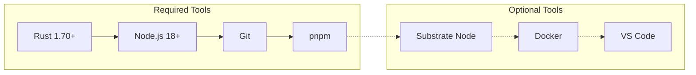
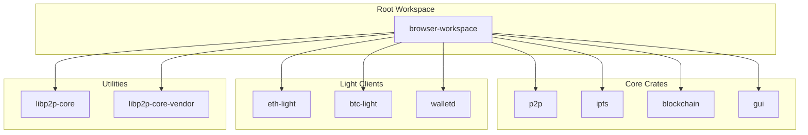
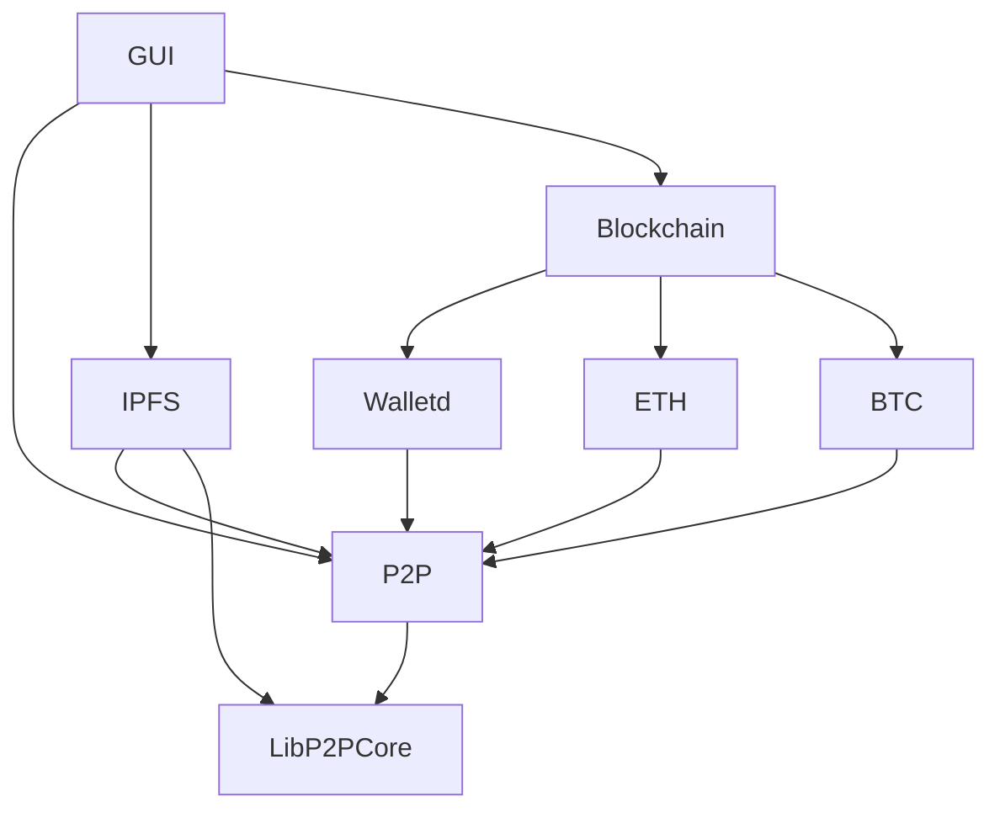
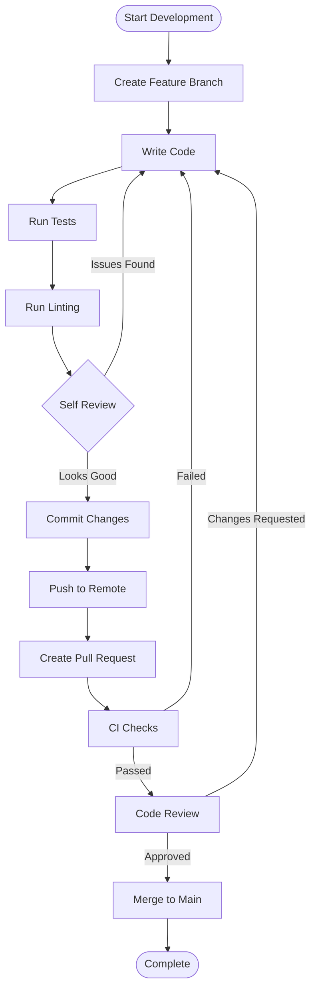
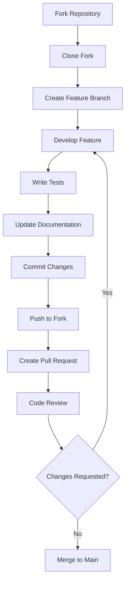

# Development Guide

## Table of Contents

- [Getting Started](#getting-started)
- [Development Environment](#development-environment)
- [Project Structure](#project-structure)
- [Development Workflow](#development-workflow)
- [Code Standards](#code-standards)
- [Testing](#testing)
- [Debugging](#debugging)
- [Performance](#performance)
- [Contributing](#contributing)

## Getting Started

### Prerequisites

Before you begin development, ensure you have the following tools installed:



#### Installation Commands

```bash
# Install Rust
curl --proto '=https' --tlsv1.2 -sSf https://sh.rustup.rs | sh
source ~/.cargo/env

# Install Node.js and pnpm
curl -fsSL https://get.pnpm.io/install.sh | sh

# Verify installations
rustc --version
node --version
pnpm --version
```

### Quick Setup

```bash
# Clone the repository
git clone https://github.com/yourusername/browser.git
cd browser

# Install dependencies
cargo build
pnpm install

# Run initial setup
pnpm run setup

# Start development
pnpm run dev
```

## Development Environment

### Recommended IDE Setup

#### VS Code Extensions

```json
{
  "recommendations": [
    "rust-lang.rust-analyzer",
    "tauri-apps.tauri-vscode",
    "bradlc.vscode-tailwindcss",
    "esbenp.prettier-vscode",
    "ms-vscode.vscode-typescript-next"
  ]
}
```

#### Settings Configuration

```json
{
  "rust-analyzer.cargo.features": "all",
  "rust-analyzer.checkOnSave.command": "clippy",
  "editor.formatOnSave": true,
  "typescript.preferences.importModuleSpecifier": "relative"
}
```

### Environment Variables

Create a `.env` file in the project root:

```bash
# Development configuration
RUST_LOG=debug
BROWSER_DEV_MODE=true
IPFS_API_PORT=5001
P2P_LISTEN_PORT=4001

# Optional: Blockchain endpoints for testing
SUBSTRATE_WS_URL=ws://localhost:9944
ETHEREUM_RPC_URL=http://localhost:8545
```

## Project Structure

### Workspace Organization



### Crate Dependencies



### Directory Structure

```
browser/
├── crates/
│   ├── blockchain/          # Blockchain integration
│   │   ├── src/
│   │   │   ├── lib.rs      # Main library interface
│   │   │   ├── client.rs   # Substrate client
│   │   │   ├── wallet.rs   # Wallet management
│   │   │   ├── transaction.rs # Transaction handling
│   │   │   └── sync.rs     # Chain synchronization
│   │   ├── tests/          # Integration tests
│   │   └── Cargo.toml
│   │
│   ├── p2p/                # P2P networking
│   │   ├── src/
│   │   │   ├── lib.rs      # libp2p integration
│   │   │   ├── behaviour.rs # Network behavior
│   │   │   └── transport.rs # Transport configuration
│   │   ├── src/bin/
│   │   │   └── main.rs     # P2P daemon
│   │   └── Cargo.toml
│   │
│   ├── ipfs/               # IPFS implementation
│   │   ├── src/
│   │   │   ├── lib.rs      # IPFS node
│   │   │   ├── bitswap.rs  # Bitswap protocol
│   │   │   └── storage.rs  # Block storage
│   │   └── Cargo.toml
│   │
│   └── gui/                # Frontend application
│       ├── src/            # TypeScript source
│       ├── src-tauri/      # Tauri backend
│       ├── public/         # Static assets
│       └── package.json
│
├── docs/                   # Documentation
├── src/                    # Main application
├── target/                 # Build artifacts
├── Cargo.toml             # Workspace configuration
└── package.json           # Node.js workspace
```

## Development Workflow

### Branch Strategy

```mermaid
gitgraph
    commit id: "Initial"
    branch develop
    checkout develop
    commit id: "Setup"
    
    branch feature/p2p-networking
    checkout feature/p2p-networking
    commit id: "Add libp2p"
    commit id: "Implement DHT"
    
    checkout develop
    merge feature/p2p-networking
    
    branch feature/ipfs-integration
    checkout feature/ipfs-integration
    commit id: "Add IPFS node"
    commit id: "Implement Bitswap"
    
    checkout develop
    merge feature/ipfs-integration
    
    checkout main
    merge develop
    commit id: "Release v0.1.0"
```

### Development Process



### Daily Development Commands

```bash
# Start development environment
pnpm run dev

# Run specific crate in development
cargo run -p p2p
cargo run -p blockchain

# Run tests continuously
cargo watch -x test
pnpm run test:watch

# Format and lint
cargo fmt
cargo clippy
pnpm run lint

# Build for production
cargo build --release
pnpm run build
```

## Code Standards

### Rust Code Standards

#### Formatting and Linting

```toml
# .rustfmt.toml
max_width = 100
hard_tabs = false
tab_spaces = 4
newline_style = "Unix"
use_small_heuristics = "Default"
reorder_imports = true
reorder_modules = true
remove_nested_parens = true
edition = "2021"
```

#### Clippy Configuration

```toml
# Cargo.toml
[lints.clippy]
all = "warn"
pedantic = "warn"
nursery = "warn"
cargo = "warn"

# Allow some pedantic lints that are too strict
module_name_repetitions = "allow"
similar_names = "allow"
too_many_lines = "allow"
```

#### Code Organization

```rust
// Example module structure
//! Module documentation
//! 
//! This module provides...

use std::collections::HashMap;
use anyhow::{Result, anyhow};
use tokio::sync::RwLock;

// Re-exports
pub use self::client::Client;
pub use self::error::Error;

// Modules
mod client;
mod error;
mod utils;

/// Public struct documentation
#[derive(Debug, Clone)]
pub struct ExampleStruct {
    /// Field documentation
    pub field: String,
    /// Private field
    private_field: u32,
}

impl ExampleStruct {
    /// Constructor documentation
    pub fn new(field: String) -> Self {
        Self {
            field,
            private_field: 0,
        }
    }
    
    /// Method documentation
    pub async fn process(&self) -> Result<()> {
        // Implementation
        Ok(())
    }
}
```

### TypeScript Code Standards

#### ESLint Configuration

```json
{
  "extends": [
    "@typescript-eslint/recommended",
    "prettier"
  ],
  "rules": {
    "@typescript-eslint/no-unused-vars": "error",
    "@typescript-eslint/explicit-function-return-type": "warn",
    "prefer-const": "error",
    "no-var": "error"
  }
}
```

#### Code Organization

```typescript
// interfaces/types.ts
export interface ContentRequest {
  url: string;
  method: 'GET' | 'POST';
  headers?: Record<string, string>;
}

export type ContentResponse = {
  data: Uint8Array;
  contentType: string;
  status: number;
};

// services/contentService.ts
import { ContentRequest, ContentResponse } from '../interfaces/types';

export class ContentService {
  private cache = new Map<string, ContentResponse>();

  async fetchContent(request: ContentRequest): Promise<ContentResponse> {
    // Implementation
  }

  private async fetchFromIPFS(cid: string): Promise<Uint8Array> {
    // Implementation
  }
}
```

### Documentation Standards

#### Rust Documentation

```rust
/// Fetches content from IPFS using the provided CID.
/// 
/// # Arguments
/// 
/// * `cid` - The Content Identifier for the requested content
/// * `timeout` - Optional timeout for the request
/// 
/// # Returns
/// 
/// Returns a `Result` containing the content bytes on success, or an error.
/// 
/// # Examples
/// 
/// ```rust
/// use ipfs::IPFSNode;
/// 
/// let node = IPFSNode::new().await?;
/// let content = node.get_content("QmHash123", None).await?;
/// ```
/// 
/// # Errors
/// 
/// This function will return an error if:
/// * The CID is invalid
/// * The content is not found
/// * Network timeout occurs
pub async fn get_content(
    &self, 
    cid: &str, 
    timeout: Option<Duration>
) -> Result<Vec<u8>> {
    // Implementation
}
```

#### TypeScript Documentation

```typescript
/**
 * Manages peer-to-peer connections and content routing
 * 
 * @example
 * ```typescript
 * const p2p = new P2PManager();
 * await p2p.initialize();
 * const content = await p2p.fetchContent('QmHash123');
 * ```
 */
export class P2PManager {
  /**
   * Fetches content from the P2P network
   * 
   * @param cid - Content identifier
   * @param options - Fetch options
   * @returns Promise resolving to content data
   * @throws {NetworkError} When content cannot be retrieved
   */
  async fetchContent(
    cid: string, 
    options?: FetchOptions
  ): Promise<Uint8Array> {
    // Implementation
  }
}
```

## Testing

### Testing Strategy

```mermaid
pyramid
    title Testing Pyramid
    "E2E Tests" : 10
    "Integration Tests" : 30
    "Unit Tests" : 60
```

### Rust Testing

#### Unit Tests

```rust
#[cfg(test)]
mod tests {
    use super::*;
    use tokio_test;

    #[tokio::test]
    async fn test_wallet_creation() {
        let wallet = Wallet::new();
        assert!(wallet.list_keys().is_empty());
        
        let keypair = wallet.create_key("test").unwrap();
        assert_eq!(wallet.list_keys().len(), 1);
        assert!(wallet.get_key("test").is_some());
    }

    #[test]
    fn test_transaction_signing() {
        let keypair = KeyPair::generate(KeyType::Sr25519).unwrap();
        let mut tx = Transaction::new(
            keypair.public_key(),
            AccountId::from([1u8; 32]),
            1000,
            0,
            0,
            Era::Immortal,
        );
        
        tx.sign(&keypair).unwrap();
        assert!(tx.verify());
    }
}
```

#### Integration Tests

```rust
// tests/integration_tests.rs
use browser_blockchain::*;
use test_utils::*;

#[tokio::test]
async fn test_full_transaction_flow() {
    let node = start_test_substrate_node().await;
    let client = SubstrateClient::new(test_config()).await.unwrap();
    
    // Wait for connection
    client.wait_for_connection().await.unwrap();
    
    // Create and submit transaction
    let tx = create_test_transaction();
    let hash = client.submit_transaction(tx).await.unwrap();
    
    // Verify transaction inclusion
    let block = client.wait_for_transaction(hash).await.unwrap();
    assert!(block.contains_transaction(hash));
    
    node.stop().await;
}
```

### TypeScript Testing

#### Unit Tests with Vitest

```typescript
// tests/contentService.test.ts
import { describe, it, expect, vi } from 'vitest';
import { ContentService } from '../src/services/contentService';

describe('ContentService', () => {
  it('should fetch content from IPFS', async () => {
    const service = new ContentService();
    const mockFetch = vi.fn().mockResolvedValue(new Uint8Array([1, 2, 3]));
    
    service.fetchFromIPFS = mockFetch;
    
    const result = await service.fetchContent({
      url: 'ipfs://QmHash123',
      method: 'GET'
    });
    
    expect(result.data).toEqual(new Uint8Array([1, 2, 3]));
    expect(mockFetch).toHaveBeenCalledWith('QmHash123');
  });
});
```

#### End-to-End Tests with Playwright

```typescript
// tests/e2e/browser.spec.ts
import { test, expect } from '@playwright/test';

test('should load IPFS content', async ({ page }) => {
  await page.goto('/');
  
  // Enter IPFS URL
  await page.fill('[data-testid="address-bar"]', 'ipfs://QmHash123');
  await page.press('[data-testid="address-bar"]', 'Enter');
  
  // Wait for content to load
  await expect(page.locator('[data-testid="content"]')).toBeVisible();
  
  // Verify content is displayed
  const content = await page.textContent('[data-testid="content"]');
  expect(content).toContain('Expected content');
});

test('should create and sign transaction', async ({ page }) => {
  await page.goto('/wallet');
  
  // Create new wallet
  await page.click('[data-testid="create-wallet"]');
  await page.fill('[data-testid="wallet-name"]', 'test-wallet');
  await page.click('[data-testid="confirm-create"]');
  
  // Send transaction
  await page.click('[data-testid="send-transaction"]');
  await page.fill('[data-testid="recipient"]', '5GrwvaEF5zXb26Fz9rcQpDWS57CtERHpNehXCPcNoHGKutQY');
  await page.fill('[data-testid="amount"]', '1.0');
  await page.click('[data-testid="sign-and-send"]');
  
  // Verify transaction confirmation
  await expect(page.locator('[data-testid="tx-confirmation"]')).toBeVisible();
});
```

### Test Utilities

```rust
// tests/test_utils.rs
use std::time::Duration;
use tokio::process::Command;
use tempfile::TempDir;

pub struct TestSubstrateNode {
    process: tokio::process::Child,
    temp_dir: TempDir,
}

impl TestSubstrateNode {
    pub async fn start() -> Result<Self> {
        let temp_dir = TempDir::new()?;
        let mut cmd = Command::new("substrate");
        cmd.args(&[
            "--dev",
            "--tmp",
            "--ws-port", "9944",
            "--rpc-port", "9933",
        ]);
        
        let process = cmd.spawn()?;
        
        // Wait for node to start
        tokio::time::sleep(Duration::from_secs(3)).await;
        
        Ok(Self { process, temp_dir })
    }
    
    pub async fn stop(mut self) {
        let _ = self.process.kill().await;
    }
}

pub fn test_config() -> SubstrateConfig {
    SubstrateConfig {
        node_url: "ws://localhost:9944".to_string(),
        ..Default::default()
    }
}
```

## Debugging

### Logging Configuration

```rust
// Initialize logging
use tracing_subscriber::{layer::SubscriberExt, util::SubscriberInitExt};

fn init_logging() {
    tracing_subscriber::registry()
        .with(tracing_subscriber::EnvFilter::new(
            std::env::var("RUST_LOG").unwrap_or_else(|_| "info".into()),
        ))
        .with(tracing_subscriber::fmt::layer())
        .init();
}

// Use in code
use tracing::{info, warn, error, debug, trace};

#[tracing::instrument]
async fn fetch_content(cid: &str) -> Result<Vec<u8>> {
    info!("Fetching content for CID: {}", cid);
    
    match ipfs_get(cid).await {
        Ok(content) => {
            debug!("Successfully fetched {} bytes", content.len());
            Ok(content)
        }
        Err(e) => {
            error!("Failed to fetch content: {}", e);
            Err(e)
        }
    }
}
```

### Debug Tools

#### Network Debugging

```bash
# Monitor P2P connections
cargo run -p p2p -- --debug-peers

# IPFS debugging
RUST_LOG=ipfs=debug cargo run

# Blockchain client debugging
RUST_LOG=blockchain=debug,substrate=debug cargo run
```

#### Frontend Debugging

```typescript
// Debug service worker
if (import.meta.env.DEV) {
  window.debugP2P = {
    peers: () => p2pService.getPeers(),
    content: (cid: string) => p2pService.fetchContent(cid),
    stats: () => p2pService.getStats(),
  };
}
```

## Performance

### Profiling

#### Rust Profiling

```bash
# CPU profiling with perf
cargo build --release
perf record --call-graph=dwarf ./target/release/browser
perf report

# Memory profiling with valgrind
cargo build
valgrind --tool=massif ./target/debug/browser

# Benchmarking
cargo bench
```

#### Memory Management

```rust
// Use Arc for shared data
use std::sync::Arc;
use tokio::sync::RwLock;

type SharedState = Arc<RwLock<AppState>>;

// Avoid unnecessary clones
fn process_data(data: &[u8]) -> Result<Vec<u8>> {
    // Process without cloning
    data.iter().map(|&b| b.wrapping_add(1)).collect()
}

// Use streaming for large data
use futures::stream::{Stream, StreamExt};

async fn process_large_content<S>(stream: S) -> Result<()>
where
    S: Stream<Item = Result<bytes::Bytes>>,
{
    let mut stream = std::pin::pin!(stream);
    while let Some(chunk) = stream.next().await {
        let chunk = chunk?;
        // Process chunk without loading entire content
        process_chunk(&chunk).await?;
    }
    Ok(())
}
```

### Optimization Guidelines

1. **Async/Await**: Use async for I/O operations
2. **Zero-Copy**: Avoid unnecessary data copying
3. **Lazy Loading**: Load resources on demand
4. **Caching**: Cache frequently accessed data
5. **Connection Pooling**: Reuse network connections

## Contributing

### Pull Request Process



### Commit Message Format

```
type(scope): subject

body

footer
```

Examples:
```
feat(p2p): add Kademlia DHT implementation

Implement Kademlia distributed hash table for peer discovery
and content routing. Includes bootstrap node configuration
and periodic routing table maintenance.

Closes #123
```

```
fix(wallet): resolve transaction signing issue

Fix bug where transactions were not properly signed when using
Ed25519 keys. The issue was caused by incorrect message hashing.

Fixes #456
```

### Code Review Checklist

- [ ] Code follows style guidelines
- [ ] Tests are included and passing
- [ ] Documentation is updated
- [ ] No breaking changes without discussion
- [ ] Performance impact considered
- [ ] Security implications reviewed
- [ ] Error handling is appropriate

This development guide provides the foundation for contributing to the decentralized browser project. Follow these guidelines to ensure code quality, maintainability, and project success.
