# User Guide

## Table of Contents

- [Installation](#installation)
- [Getting Started](#getting-started)
- [Basic Usage](#basic-usage)
- [Wallet Management](#wallet-management)
- [Content Navigation](#content-navigation)
- [Configuration](#configuration)
- [Troubleshooting](#troubleshooting)
- [Advanced Features](#advanced-features)

## Installation

### System Requirements

- **Operating System**: Windows 10+, macOS 10.15+, or Linux (Ubuntu 18.04+)
- **RAM**: Minimum 4GB, Recommended 8GB+
- **Storage**: 2GB free space for installation, additional space for content cache
- **Network**: Internet connection for initial setup and P2P networking

### Download and Install

#### Option 1: Pre-built Binaries (Recommended)


#### Option A: Download from GitHub Releases

1. Visit the [Releases page](https://github.com/advatar/browser/releases)
2. Download the appropriate installer for your platform:
   - **Windows**: `decentralized-browser-v0.1.0.msi`
   - **macOS**: `decentralized-browser-v0.1.0.dmg`
   - **Linux**: `decentralized-browser-v0.1.0.AppImage`, `decentralized-browser-v0.1.0.deb`, or `decentralized-browser-v0.1.0.rpm`

#### Option B: Download from Repository

Alternatively, download directly from the repository's dist/ folder:

- **Windows**: [decentralized-browser-v0.1.0.msi](../dist/decentralized-browser-v0.1.0.msi)
- **macOS**: [decentralized-browser-v0.1.0.dmg](../dist/decentralized-browser-v0.1.0.dmg)
- **Linux (DEB)**: [decentralized-browser-v0.1.0.deb](../dist/decentralized-browser-v0.1.0.deb)
- **Linux (RPM)**: [decentralized-browser-v0.1.0.rpm](../dist/decentralized-browser-v0.1.0.rpm)
- **Linux (AppImage)**: [decentralized-browser-v0.1.0.AppImage](../dist/decentralized-browser-v0.1.0.AppImage)

#### Verify Download (Recommended)

```bash
# Download checksums and signatures
curl -O https://github.com/advatar/browser/releases/download/v0.1.0/checksums.txt
curl -O https://github.com/advatar/browser/releases/download/v0.1.0/signatures.asc

# Verify checksum (example for Windows)
sha256sum -c checksums.txt --ignore-missing

# Verify GPG signature
gpg --verify signatures.asc decentralized-browser-v0.1.0.msi
```

4. Install the application:
   - **Windows**: Double-click the `.msi` file and follow the installer
   - **macOS**: Open the `.dmg` file and drag the app to Applications
   - **Linux**: Make the AppImage executable and run, or install the `.deb` package

#### Option 2: Build from Source

```bash
# Clone the repository
git clone https://github.com/advatar/browser.git
cd browser

# Install dependencies
cargo build --release
pnpm install && pnpm run build

# Run the application
./target/release/browser
```

## Getting Started

### First Launch

When you first launch the browser, you'll go through an initial setup process:


### Welcome Screen

The welcome screen will guide you through:

1. **Network Setup**: Configure P2P networking preferences
2. **Wallet Creation**: Create your first wallet for blockchain interactions
3. **Privacy Settings**: Choose your privacy and security preferences
4. **Content Sources**: Select which content networks to enable

### Interface Overview


## Basic Usage

### Navigating to Content

#### IPFS Content

To access content stored on IPFS:

1. Enter an IPFS URL in the address bar:
   ```
   ipfs://QmYwAPJzv5CZsnA625s3Xf2nemtYgPpHdWEz79ojWnPbdG
   ```

2. The browser will:
   - Query the DHT for content providers
   - Download content blocks from peers
   - Verify content integrity
   - Display the assembled content

#### IPNS Content (Mutable)

For mutable content that can be updated:

1. Enter an IPNS URL:
   ```
   ipns://k51qzi5uqu5djdczd6zw0grmo23j2vkj9uzvujencg15s5rlkq0ss4ivll8wqw
   ```

2. The browser will resolve the current IPFS hash and load the content

#### ENS Domains

For Ethereum Name Service domains:

1. Enter an ENS domain:
   ```
   ens://vitalik.eth
   ```

2. The browser will:
   - Query the ENS contract on Ethereum
   - Resolve to an IPFS hash
   - Load the content from IPFS

### Content Types

The browser supports various content types:


### Bookmarking Content

To bookmark content:

1. Navigate to the content you want to bookmark
2. Click the bookmark icon in the address bar
3. Choose a name and folder for the bookmark
4. The content will be pinned locally for faster access

## Wallet Management

### Creating a Wallet


1. Open the wallet panel from the side menu
2. Click "Create New Wallet"
3. Choose your preferred key type:
   - **Sr25519**: Recommended for Substrate-based chains
   - **Ed25519**: Good for general use and some blockchains
   - **ECDSA**: Compatible with Ethereum and Bitcoin
4. **Important**: Write down your seed phrase and store it securely
5. Verify your seed phrase by entering it again
6. Set a strong password for local wallet encryption

### Importing an Existing Wallet

To import a wallet from a seed phrase:

1. Click "Import Wallet" in the wallet panel
2. Enter your 12 or 24-word seed phrase
3. Choose the derivation path (or use default)
4. Set a password for local encryption
5. The wallet will be imported and ready to use

### Hardware Wallet Integration

For enhanced security, connect a hardware wallet:

1. Connect your hardware wallet (Ledger, Trezor, etc.)
2. Click "Connect Hardware Wallet" in the wallet panel
3. Follow the on-screen instructions to pair the device
4. Approve the connection on your hardware wallet
5. The hardware wallet will appear in your wallet list

### Sending Transactions


To send a transaction:

1. Open the wallet panel
2. Select the wallet you want to send from
3. Click "Send"
4. Enter the recipient address
5. Enter the amount to send
6. Set the transaction fee (or use recommended)
7. Review the transaction details
8. Click "Sign and Send"
9. Confirm on your hardware wallet if applicable

## Content Navigation

### Address Bar Features

The address bar supports multiple URL schemes:

| Scheme | Example | Description |
|--------|---------|-------------|
| `ipfs://` | `ipfs://QmHash...` | Direct IPFS content |
| `ipns://` | `ipns://k51qzi5uqu5d...` | Mutable IPNS content |
| `ens://` | `ens://example.eth` | Ethereum Name Service |
| `http://` | `http://example.com` | Traditional web (via bridge) |
| `https://` | `https://example.com` | Secure web (via bridge) |

### Navigation Controls

```mermaid
graph LR
    Back[← Back] --> Forward[Forward →]
    Forward --> Reload[⟳ Reload]
    Reload --> Home[🏠 Home]
    Home --> Bookmark[⭐ Bookmark]
```



- **Back/Forward**: Navigate through your browsing history
- **Reload**: Refresh the current content (re-fetches from network)
- **Home**: Go to your configured home page
- **Bookmark**: Add current content to bookmarks

### Tab Management

- **New Tab**: Ctrl+T (Cmd+T on macOS)
- **Close Tab**: Ctrl+W (Cmd+W on macOS)
- **Switch Tabs**: Ctrl+Tab or click tab headers
- **Reopen Closed Tab**: Ctrl+Shift+T (Cmd+Shift+T on macOS)

### Content Search

Use the search functionality to find content:

1. Press Ctrl+F (Cmd+F on macOS) to open search
2. Enter your search terms
3. Use arrow keys to navigate between matches
4. Press Escape to close search

## Configuration

### Network Settings

Configure P2P networking options:


Access network settings through Settings → Network:

- **Listen Port**: Port for incoming P2P connections
- **Bootstrap Nodes**: Initial peers to connect to
- **Max Peers**: Maximum number of simultaneous connections
- **Bandwidth Limits**: Upload/download speed limits
- **Protocol Options**: Enable/disable specific protocols

### Privacy Settings

Configure privacy and security options:

- **Telemetry**: Disable all telemetry (recommended)
- **DNS Fallback**: Allow DNS resolution for traditional domains
- **HTTP Bridge**: Enable HTTP/HTTPS bridge for legacy content
- **Content Filtering**: Block known malicious content
- **Peer Blacklist**: Block connections from specific peers

### Storage Settings

Manage local storage and caching:

- **Cache Size**: Maximum size for content cache
- **Pin Duration**: How long to keep pinned content
- **Auto-Pin**: Automatically pin frequently accessed content
- **Storage Location**: Where to store cached content
- **Cleanup Schedule**: Automatic cleanup of old cache

### Wallet Settings

Configure wallet behavior:

- **Default Wallet**: Which wallet to use by default
- **Transaction Fees**: Default fee settings
- **Confirmation Requirements**: Number of confirmations to wait
- **Hardware Wallet**: Hardware wallet configuration
- **Backup Reminders**: Periodic backup reminders

## Troubleshooting

### Common Issues

#### Cannot Connect to Peers

**Symptoms**: No peer connections, content fails to load

**Solutions**:
1. Check your internet connection
2. Verify firewall settings allow the P2P port
3. Try different bootstrap nodes
4. Check if your ISP blocks P2P traffic

```bash
# Test connectivity
telnet bootstrap.node.example.com 4001
```

#### Content Loading Slowly

**Symptoms**: IPFS content takes a long time to load

**Solutions**:
1. Increase the number of peers
2. Pin frequently accessed content
3. Check bandwidth settings
4. Use content with more providers

#### Wallet Issues

**Symptoms**: Cannot sign transactions, wallet not responding

**Solutions**:
1. Restart the application
2. Check hardware wallet connection
3. Verify wallet password
4. Re-import wallet if necessary

#### High Resource Usage

**Symptoms**: High CPU or memory usage

**Solutions**:
1. Reduce maximum peers
2. Lower bandwidth limits
3. Decrease cache size
4. Close unused tabs

### Debug Information

To gather debug information for support:

1. Open Settings → Advanced → Debug
2. Click "Generate Debug Report"
3. Save the report file
4. Include the report when filing issues

### Log Files

Log files are stored in:
- **Windows**: `%APPDATA%\browser\logs\`
- **macOS**: `~/Library/Logs/browser/`
- **Linux**: `~/.local/share/browser/logs/`

## Advanced Features

### Command Line Interface

The browser includes a CLI for advanced operations:

```bash
# Start with custom configuration
browser --config /path/to/config.toml

# Enable debug logging
browser --log-level debug

# Specify custom data directory
browser --data-dir /path/to/data

# Connect to specific bootstrap nodes
browser --bootstrap /ip4/192.168.1.100/tcp/4001/p2p/12D3KooW...
```

### Extension System

Install extensions for additional functionality:

1. Download extension from IPFS
2. Open Settings → Extensions
3. Click "Install Extension"
4. Select the extension file
5. Grant necessary permissions
6. The extension will be available in the browser

### API Access

For developers, the browser exposes APIs for integration:

```javascript
// Access P2P functionality
const p2p = await window.browser.p2p;
const peers = await p2p.getPeers();

// IPFS operations
const ipfs = await window.browser.ipfs;
const content = await ipfs.get('QmHash...');

// Wallet operations
const wallet = await window.browser.wallet;
const address = await wallet.getAddress();
```

### Content Publishing

Publish your own content to IPFS:

1. Create your content (HTML, images, etc.)
2. Open Developer Tools → IPFS Publisher
3. Select files or folder to publish
4. Click "Publish to IPFS"
5. Share the returned IPFS hash

### Network Statistics

Monitor network performance:

1. Open Settings → Network → Statistics
2. View connection statistics
3. Monitor bandwidth usage
4. Check peer information
5. Export statistics for analysis

This user guide covers the essential features and functionality of the decentralized browser. For technical details and development information, refer to the [Development Guide](DEVELOPMENT.md) and [Architecture Guide](ARCHITECTURE.md).
